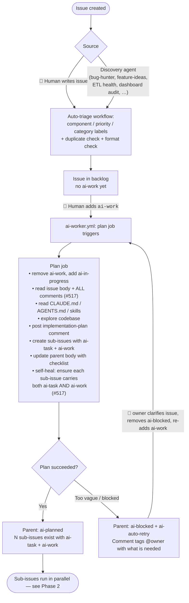
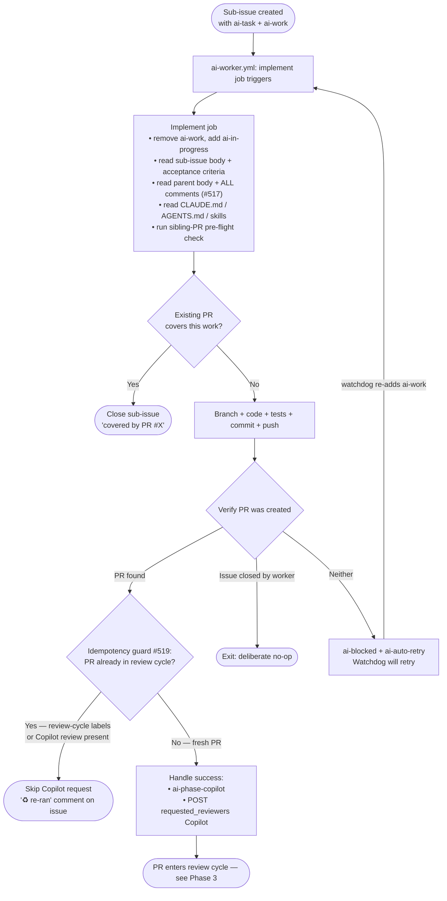
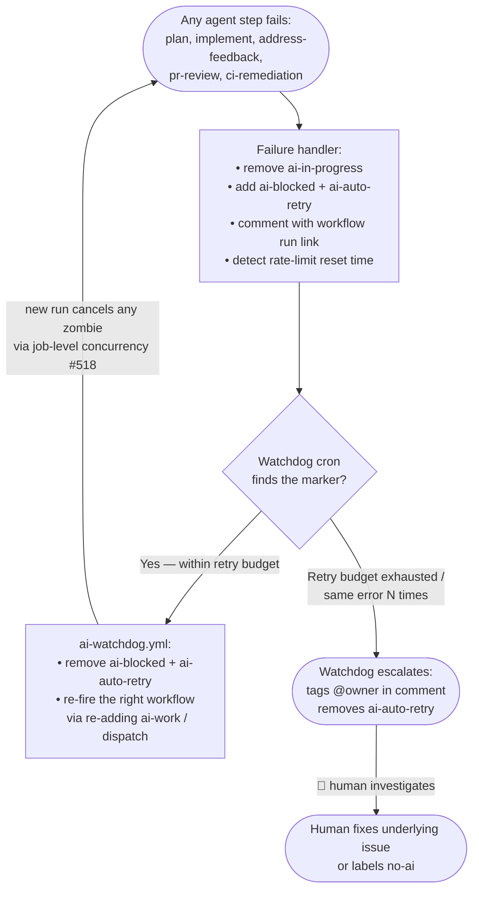

# AI Factory — User Guide

> The AI Factory is an autonomous development pipeline for PowerShop Analytics. It uses Claude (via GitHub Actions) to discover work, plan implementations, write code, review PRs, and manage deployments. This guide explains **how humans use it**.

## What the AI Factory Does For You

You describe what you want in an issue; the factory implements it, reviews it, and prepares it for deployment. You stay in control through labels, comments, and merge approvals — but you don't write boilerplate, triage bugs, or chase stale PRs.

```
You:   "Add a health check endpoint to the ETL service"   (open an issue)
You:   label it "ai-work"
AI:    triages, plans, creates a branch, implements, opens a PR, runs tests
AI:    reviews the PR, posts inline comments, fixes any CI failures
You:   approve and merge
AI:    weekly auto-release bundles your change into a new version
AI:    Docker images are pushed, production notification issue created
```

Your total effort: **~15 minutes per day** reviewing the daily project summary, labeling issues, and merging PRs.

## Getting Started

### 1. One-time setup

Add these secrets to the repository (`Settings → Secrets and variables → Actions`):

| Secret | Required | Purpose |
|--------|----------|---------|
| `ANTHROPIC_API_KEY` | **Yes** | Powers all AI workflows (Claude Code Action) |
| `DOCKERHUB_USERNAME` | For releases | Pushes Docker images |
| `DOCKERHUB_TOKEN` | For releases | Pushes Docker images |
| `OPENROUTER_API_KEY` | Optional | Used by WrenAI and Dashboard App (existing secret) |

Once `ANTHROPIC_API_KEY` is set, the factory activates automatically. Scheduled workflows start running on their cron, and event-driven workflows respond to issues/PRs/comments.

### 2. Verify it works

Open the **Actions** tab and manually trigger **AI Factory Test** (`workflow_dispatch`). You should see Claude respond within a minute.

## How You Interact With the Factory

Four mechanisms cover 95% of your day-to-day use.

### a) Open an issue

Write what you want. The more specific the issue, the better the result.

**Good issue:**
> **Title**: Add `/api/health` endpoint to dashboard returning ETL sync status
>
> **Body**: Create `dashboard/app/api/health/route.ts` that queries the `watermark` table and returns `{ status: "ok" | "stale", last_sync: timestamp }`. Stale if last_sync > 48 hours old. Include a Vitest test.

**Bad issue:**
> Make the dashboard better

When a new issue is opened, the **Issue Triage** workflow runs automatically — it labels the issue by component, priority, category, and checks for duplicates.

### b) Use labels to steer the AI

| Label | Meaning |
|-------|---------|
| `ai-work` | Start autonomous implementation. The AI Worker picks this up, creates a branch, implements the change, runs tests, and opens a PR. |
| `ai-blocked` | The AI hit a blocker and needs human input. Check the issue comments. |
| `ai-in-progress` | The worker is currently running (auto-set). |
| `ai-planned` | The `/plan` command has posted an implementation plan (auto-set). |
| `no-ai` | Human-only. Factory will not touch this issue. |
| `no-pr-review` | Skip the AI PR review on this PR. |
| `auto-merge` | Merge automatically when CI passes and review approves *(reserved for future use)*. |
| `p0-critical` → `p3-low` | Priority — the factory processes higher priorities first. |

### c) Use slash commands in comments

Comment on any issue (not PR) with one of these:

**`/plan`** — Claude analyzes the issue, reads the codebase, and posts a structured implementation plan. Use this **before** labeling `ai-work` if you want to review the approach first.

```
/plan
```

Response includes: analysis, files to modify, implementation steps, testing strategy, risk assessment, complexity estimate.

**`/ai <instruction>`** — Claude executes a direct instruction. Restricted to `OWNER` / `MEMBER` / `COLLABORATOR`.

```
/ai investigate why the ETL fails on Sundays and report back

/ai add retry logic to etl/sync/ventas.py with exponential backoff

/ai research what indexes we're missing on ps_lineas_ventas
```

For code-change instructions, Claude creates a branch and opens a PR. For investigation instructions, Claude posts findings as an issue comment.

### d) Review and merge PRs

When the AI opens a PR:

1. The **Claude PR Review** workflow runs automatically and posts a review (inline comments + approval or changes-requested).
2. CI runs (lint, tests, build) — same as any other PR.
3. If you request changes, the **Address PR Feedback** workflow attempts to auto-fix simple comments (typos, imports, lint, small logic fixes). Complex feedback gets a reply explaining why it's being skipped.
4. When you're happy, you merge. Auto-merge for trusted categories is disabled initially; you always click the button.

## The Daily Project Summary

Every weekday at 09:00 UTC, the factory creates a **Project Summary** issue titled `[project-summary] Project Summary — {date}`. It's your morning dashboard.

It includes:
- **Open PRs** with CI/review status
- **Merged yesterday** — what shipped
- **AI activity** — in-progress and blocked issues
- **Stale items** — PRs and issues needing attention
- **Easy pickings** — well-defined issues ready for `ai-work`
- **Health** — latest release, CI status

The previous day's summary is closed automatically. Read this, label a few issues `ai-work`, close anything resolved, and you're done.

## What Runs and When

### Event-driven (reacts immediately)

| Workflow | Trigger | What it does |
|----------|---------|-------------|
| **Issue Triage** | Issue opened | Labels component/priority/category, checks for duplicates |
| **Plan** | `/plan` comment | Posts implementation plan |
| **AI Command** | `/ai` comment | Executes direct instruction |
| **AI Worker** | `ai-work` label added | Implements issue end-to-end, opens PR |
| **PR Review** | PR opened/updated | Posts AI code review |
| **Address Feedback** | Review with changes-requested | Auto-fixes simple comments |
| **PR Labeler** | PR opened/updated | Adds `size-*` and `risk-*` labels |
| **Deploy Notify** | Release published | Creates deployment checklist issue |

### Scheduled (runs on cron)

| Workflow | Schedule | What it does |
|----------|----------|-------------|
| **Project Summary** | Weekdays 09:00 | Daily digest (your morning briefing) |
| **ETL Health Monitor** | Weekdays 08:00 | Checks ETL code/schema/sync for issues |
| **Bug Hunter** | Weekdays 11:00 | Scans recently changed files for bugs |
| **SQL Pair Validator** | Monday 10:00 | Validates WrenAI SQL pairs against schema |
| **Docs Patrol** | Tuesday 14:00 | Checks docs are accurate and current |
| **Dashboard Audit** | Wednesday 14:00 | Builds + tests dashboard, reviews quality |
| **Feature Ideas** | Thursday 14:00 | Brainstorms 3-5 actionable ideas |
| **Security Audit** | Friday 10:00 | Dependency + source security scan |
| **Stale Manager** | Friday 16:00 | Closes stale issues/PRs |
| **Auto Release** | Sunday 20:00 | Creates weekly release with changelog |

All scheduled workflows support manual triggering via `workflow_dispatch`. All follow the **"silence is golden"** principle — they only create issues when they find something genuinely worth reporting.

## Lifecycle in detail

> This section traces every state an issue passes through, from creation to merged code. It lists the workflows that drive each transition, the labels that signal state, and — most importantly — every moment a human is expected to step in.
>
> If you only read one thing, read **[Where humans intervene](#where-humans-intervene)** below.

### Mental model — three nested loops

1. **Issue loop** — a feature request goes from "open" to "all sub-issues merged" via the **planner** (the `plan` job in `ai-worker.yml`).
2. **Sub-issue loop** — each sub-issue goes from "queued" to "PR opened" via the **implementer** (the `implement` job in the same workflow).
3. **PR loop** — each PR goes from "opened" to "merged" via two automated review passes (Copilot, then Opus, per [D-021](../DECISIONS-AND-CHANGES.md#d-021)) plus the human merge.

Failures at any layer route to a recovery path: the failing object gets `ai-blocked` + `ai-auto-retry`, and `ai-watchdog.yml` retries on a schedule (or escalates to the owner if the failure persists).

### State labels at a glance

Only AI-Factory labels are listed. Component / priority / size / risk labels are unrelated to the lifecycle.

| Label | Set by | On | Means |
|-------|--------|----|-------|
| `ai-work` | 👤 human (or planner for sub-issues) | issue or PR | "AI: act on this." Trigger label for the worker. Removed as soon as a job picks it up. |
| `ai-task` | planner | sub-issue | "This is a sub-issue of an `ai-planned` parent." Distinguishes plan target vs implement target. |
| `ai-in-progress` | worker | issue | The worker is actively running. |
| `ai-planned` | planner (end of plan job) | parent issue | "Plan committed; sub-issues created." |
| `ai-blocked` | worker / address-feedback / watchdog | issue or PR | The agent couldn't proceed. The companion comment explains why. |
| `ai-auto-retry` | worker / address-feedback | issue or PR | "Watchdog: retry this." Pairs with `ai-blocked`. |
| `ai-needs-rewrite` | planner / verify steps | sub-issue | Sub-issue body got mangled (e.g. JSX/generics stripped). Don't act on it until repaired. |
| `ai-phase-copilot` | worker `Handle success` (and only there, per #519) | PR | Round 1 (Copilot review) in progress. |
| `ai-cp-after-1` | address-feedback | PR | Copilot feedback addressed. |
| `ai-phase-opus` | address-feedback | PR | Round 2 (Opus review) in progress. |
| `ai-o-after-1` | address-feedback | PR | Opus feedback addressed; cycle done. |
| `ai-awaiting-owner` | address-feedback | PR | "Both reviews complete. Human merge decision pending." |
| `ai-ci-failing` | address-feedback / ci-remediation | PR | CI is red; bot may auto-remediate. |
| `ai-ready-for-review` | address-feedback | PR | "PR is ready for the next review pass." |
| `no-ai` | 👤 human | issue or PR | Hands off. The factory will not touch this. |
| `no-pr-review` | 👤 human | PR | Skip the AI PR review on this PR. |

### Phase 1 — Issue → Plan



**Walkthrough**

1. Issue is created — by a human, or by a discovery agent on a cron. The triage workflow runs first and applies component / priority / category labels.
2. The issue sits in the backlog until a **human** explicitly adds `ai-work`. Issues from the **business-review** workflow carry `needs-human-approval` and never get `ai-work` until the owner approves — see [D-028](../DECISIONS-AND-CHANGES.md#d-028).
3. The plan job of `ai-worker.yml` removes `ai-work`, adds `ai-in-progress`, reads the issue body and **all comments**, reads project guidance (`CLAUDE.md`, `AGENTS.md`, relevant skills), explores the codebase, and writes a detailed implementation-plan comment listing every sub-task.
4. The plan job creates one GitHub sub-issue per sub-task. Each sub-issue inherits `ai-task` (so it routes to the implement job, not the plan job) and `ai-work` (so the implement job fires immediately). A self-heal step audits the sub-issues and adds whichever required label is missing — defense against the planner forgetting one of them.
5. If the plan job can't proceed (issue too vague, missing context), it tags the human owner in a comment and labels the parent `ai-blocked + ai-auto-retry`. The watchdog will retry on a schedule, or the human can intervene.

**Human checkpoints in Phase 1**

| When | What you do | Why |
|------|-------------|-----|
| Issue created by a discovery agent | Skim it; close or label `no-ai` if it's noise | Prevent the factory from chasing low-value work |
| Issue is well-scoped | Add `ai-work` | Greenlight the planner |
| Issue is ambiguous | `/plan` first to preview the planner's read; or clarify the body | Cheap "is this clear?" before committing the factory |
| Parent landed on `ai-blocked` | Read the planner's blocking comment, edit the issue with answers, remove `ai-blocked`, re-add `ai-work` | The planner needs human input |

### Phase 2 — Sub-issue → Implementation → PR



**Walkthrough**

1. The sub-issue carries both `ai-task` and `ai-work`. The implement job fires (the plan job doesn't, because of the `if:` conditions in the workflow).
2. The implement agent reads the sub-issue, **then the parent** (body + comments — that's where the architectural rationale lives, per #517). Without this read-comments step, the implementer was missing the planner's analysis.
3. **Sibling-PR pre-flight check**: if any sibling sub-issue already has a PR that covers the same work (same files, same intent), the agent closes this sub-issue with a "covered by PR #X" comment instead of opening a duplicate.
4. Otherwise: branch (`ai/issue-<N>-<slug>`), code, test, commit, push, open PR with `Closes #<N>` in the body.
5. The verify step looks up the PR by branch and by `Closes #` body match. Three outcomes:
   - **PR found** → continue to the idempotency guard.
   - **Issue closed by the worker** (sibling-PR pre-flight match) → exit.
   - **Neither** → `ai-blocked + ai-auto-retry`.
6. **Idempotency guard** (added in #519): before adding `ai-phase-copilot` and POSTing `requested_reviewers`, check the PR's labels for any of `ai-phase-copilot` / `ai-phase-opus` / `ai-cp-after-1` / `ai-o-after-1`, and check the reviews list for an existing Copilot review. If any are present, this run is a re-fire (the implementer ran twice and found the PR from the first run). Skip the Copilot request, post a `♻️ re-ran` comment on the issue, exit. **Without this guard, re-firing the worker on a sub-task that already has a PR produced a second Copilot review** — the bug fixed by #519.
7. Fresh PR: add `ai-phase-copilot`, POST `requested_reviewers` for Copilot, comment on the PR explaining the Copilot → Opus cycle. PR enters Phase 3.

**Concurrency safety** (#518): both the plan and implement jobs declare job-level `concurrency: { group: ai-worker-{plan,implement}-<issue>, cancel-in-progress: true }`. A new run on the same issue cancels the previous run for the same job. Skipped jobs (where `if:` evaluates false on unrelated label events like `p1-high`) do **not** enter the concurrency group, so they don't cancel running ai-work jobs.

**Human checkpoints in Phase 2**

| When | What you do | Why |
|------|-------------|-----|
| Sub-issue body looks mangled (empty backticks, missing JSX) | Add `ai-needs-rewrite`, fix the body, remove the label | The planner sometimes drops JSX/generics; verify steps catch most cases but not all |
| Sub-issue stalled with `ai-blocked` after multiple watchdog retries | Read the comment, decide: provide more context (re-add `ai-work`), close the sub-issue, or label `no-ai` | The watchdog retries until you intervene |
| Implementer closes a sub-issue with "covered by PR #X" | Verify the claim (rare false positive), reopen if wrong | False positives can leave work undone |

### Phase 3 — PR → Reviews → Merge

```mermaid
flowchart LR
    PR([PR created<br/>ai-phase-copilot<br/>Copilot requested]) -->|"Copilot reviews"| CR[Copilot review on PR]

    CR -->|"address-feedback fires"| AF1[Address Copilot feedback:<br/>• reply to every thread<br/>• fix code, push<br/>• replies prove every comment was read]

    AF1 --> CP1[ai-cp-after-1<br/>Remove ai-phase-copilot<br/>Add ai-phase-opus<br/>Dispatch ai-pr-review.yml]

    CP1 -->|"Opus reviews — does NOT<br/>request Copilot (#519)"| OR[Opus review on PR]

    OR -->|"address-feedback fires"| AF2[Address Opus feedback]

    AF2 --> OP1[ai-o-after-1<br/>Remove ai-phase-opus<br/>Clear ai-ready-for-review<br/>Add ai-awaiting-owner]

    OP1 -->|"👤 Human reviews + merges"| MR([Merged ✅<br/>Sub-issue closes via 'Closes #N'])
```



**Walkthrough**

1. **Round 1 — Copilot.** The worker's `Handle success` step requested Copilot when the PR was created. Copilot reviews and posts inline comments. The `address-feedback` workflow detects the new review, dispatches the agent, who replies to every comment (with a code change or an inline reply explaining why it doesn't apply), pushes, and transitions labels: add `ai-cp-after-1`, remove `ai-phase-copilot`, add `ai-phase-opus`. Dispatch `ai-pr-review.yml` for the Opus pass.
2. **Round 2 — Opus.** `ai-pr-review.yml` runs the Opus review **with no prior conversation context** (a fresh Claude Code session, per D-021), so the review is independent of the implementation history. Opus posts a review with inline comments. **Per #519, the Opus prompt explicitly does NOT request another Copilot review** — `requested_reviewers` is never POSTed from this step. Address-feedback fires again, addresses the Opus comments, lands `ai-o-after-1`.
3. **Convergence.** Both `ai-cp-after-1` and `ai-o-after-1` are on the PR. Address-feedback removes the phase labels, clears `ai-ready-for-review`, adds `ai-awaiting-owner`. The PR is now waiting for a human merge.
4. **Human merge.** The owner reviews the PR (the AI's review history is captured inline), checks CI is green, clicks **Merge**. The PR's `Closes #<sub-issue>` body trailer closes the sub-issue automatically. When all sub-issues of a parent are closed, the parent can be closed by the owner (or via a final summary comment).

**Why exactly two reviews and not more** — per [D-021](../DECISIONS-AND-CHANGES.md#d-021), iterating "until there are no comments" produced long loops where late nit-pick rounds blocked merges without meaningfully improving the code. Two independent reviews each run once is the cap. Genuinely blocking issues from a later round are escalated to the human owner rather than triggering a third round.

**Human checkpoints in Phase 3**

| When | What you do | Why |
|------|-------------|-----|
| PR landed `ai-awaiting-owner` | Review the PR yourself; the AI review threads are inline | This is the gate before code lands on `main` |
| You disagree with Copilot or Opus | Comment on the PR; or merge anyway after reading both reviews | The factory respects human override |
| CI is red on a PR (`ai-ci-failing` label) | Wait for `ai-ci-remediation` to attempt a fix; if it can't, the PR ends up `ai-blocked` and you debug | Most CI failures are auto-fixable; the rest need a human |
| You want to skip automated review on a PR | Add `no-pr-review` before review fires | E.g. WIP PR that shouldn't burn budget |
| You want to stop the cycle on a PR | Close the PR | Always allowed |
| A merge conflict appears | `ai-pr-mergeability.yml` attempts to resolve it; otherwise comment, the agent (or you) rebases | Most conflicts are mechanical |

### Failure modes & recovery



Recovery is always **automatic-then-human**: transient failures (rate limits, network blips, GHA flakes) are absorbed by the watchdog. Repeated failures on the same step escalate. The owner intervenes only when automation has given up — not on every flake.

### Where humans intervene

This is the canonical list of human touchpoints across the entire lifecycle. **Outside of these, the factory operates autonomously.**

| # | Touchpoint | Action | Frequency |
|---|------------|--------|-----------|
| 1 | New issue is well-scoped | Add `ai-work` | Per issue you want the factory to work on |
| 2 | New issue is ambiguous | `/plan` to preview the planner's read; clarify the body if needed | Per ambiguous issue |
| 3 | Discovery agent created an issue | Skim, close if noise, or label `ai-work` if real | Daily, in the project summary |
| 4 | Issue / sub-issue / PR landed `ai-blocked` and watchdog escalated | Read the comment, fix the underlying problem, remove `ai-blocked` | Rare — watchdog absorbs most blocks |
| 5 | Sub-issue body is mangled | Add `ai-needs-rewrite`, repair the body | Very rare; verify steps catch most cases |
| 6 | PR is `ai-awaiting-owner` | Review the PR + the inline AI review history; merge or request changes | Per PR |
| 7 | You disagree with a Copilot or Opus comment | Reply yourself or override at merge | Per disagreement |
| 8 | A workflow is mis-firing (rare bug in the factory) | Open an issue tagged `ai-factory`; if urgent, add `ai-blocked` + `no-ai` to the affected items | Very rare |
| 9 | OAuth token actually expired and the host can't refresh through Cloudflare | Run `ps prod login` (or `claude /login` on the relevant host) | Per token-expiry incident — see [D-025](../DECISIONS-AND-CHANGES.md#d-025) |
| 10 | A `business-review` issue arrives with `needs-human-approval` | Decide whether to authorize: remove `needs-human-approval`, add `ai-work` (or close) | Weekly per [D-028](../DECISIONS-AND-CHANGES.md#d-028) |
| 11 | You want to fast-merge without review | Add `no-pr-review` before opening, merge yourself | Per exception |
| 12 | Token refresh required across the launchd-synced container | One-time `claude /login` interactively; agent syncs from the keychain | Per token-expiry incident — see [D-025](../DECISIONS-AND-CHANGES.md#d-025) |

### Three lifecycles, end to end

#### Best case — everything green

1. Owner opens issue: "Add a `/api/health` endpoint to the dashboard." Adds `ai-work`.
2. Plan job runs (~3 min). Posts a plan comment. Creates 2 sub-issues (route + test) with `ai-task` + `ai-work`.
3. Two implement jobs run in parallel (~5 min each). Each opens a PR. Each requests Copilot.
4. Copilot reviews both PRs (~5 min each). Address-feedback dispatches Opus on both.
5. Opus reviews both PRs (~5 min each). Address-feedback converges both to `ai-awaiting-owner`.
6. Owner reviews and merges both PRs. Sub-issues close via `Closes #N`. Owner closes the parent.
7. **Total wall time: ~25–35 minutes. Owner effort: ~5 minutes** (reading + clicking merge).

#### Recovered failure — transient flake

1. Implement job hits an OpenRouter rate limit at the test step. Workflow detects the rate-limit reset time, posts the failure comment with `⏳ Rate limit reset at HH:MM`, sets `ai-blocked + ai-auto-retry`.
2. Watchdog cron picks up the marker after the reset window. Re-fires the worker.
3. Job-level `cancel-in-progress` ensures any zombie run is killed before the new attempt starts.
4. Second attempt succeeds. PR opens normally. Continues through Phase 3.
5. **Owner effort: zero**. The flake never reached them.

#### Blocked — human intervention required

1. Owner opens issue: "Make the dashboard better." Adds `ai-work`.
2. Plan job reads the issue, can't extract concrete sub-tasks. Tags `@owner`, asks for specific endpoints / behaviour / acceptance criteria. Sets `ai-blocked + ai-auto-retry`.
3. Watchdog retries. Same outcome — issue is genuinely too vague.
4. Watchdog escalates: comment tags `@owner` saying "tried 3 times, same blocker, your turn."
5. Owner edits the issue with concrete acceptance criteria. Removes `ai-blocked`. Re-adds `ai-work`.
6. Plan job re-runs successfully. Phase 1 → 3 proceeds normally.
7. **Owner effort: 2–5 minutes** to add the missing detail.


## Common Scenarios

### "I want the AI to fix this bug"
1. Open an issue describing the bug with reproduction steps
2. *(Optional)* Comment `/plan` to preview the approach
3. Add label `ai-work`
4. Review the resulting PR, merge when ready

### "I want to investigate something without writing code"
Comment on any issue (or open a new one):
```
/ai check which ps_* tables are missing indexes and report back
```

### "I want to temporarily disable AI on a PR"
Add the `no-pr-review` label.

### "An AI-generated PR has a bug"
Leave a review comment describing the problem. The **Address Feedback** workflow will attempt to fix it. For complex changes, the AI will reply explaining why it can't auto-fix, and you can use `/ai` in the issue to give more specific direction.

### "I want to stop a running AI Worker"
Cancel the workflow run in the Actions tab. The `ai-in-progress` label won't be removed automatically — remove it manually.

### "I don't want the AI touching this issue at all"
Add the `no-ai` label before opening.

## Troubleshooting

**The AI Worker created a PR but it's wrong.** Close the PR, add more detail to the issue (acceptance criteria, file paths, examples), remove `ai-in-progress`/`ai-blocked`, and re-label `ai-work`.

**A workflow failed with an auth error.** Check that `ANTHROPIC_API_KEY` is set as a repository secret (not environment secret) and hasn't expired.

**The AI keeps making the same mistake.** Update the relevant project documentation (`AGENTS.md`, `docs/skills/*.md`, or `CLAUDE.md`). The Claude Code Action reads these automatically, so fixes there propagate to every workflow.

**Too many AI-generated issues cluttering the backlog.** The **Stale Manager** closes AI issues after 21 days of inactivity. You can also use `gh issue list --label "ai-bug" --search "no:assignee"` to triage in bulk.

**Rate limits or cost concerns.** Disable specific scheduled workflows by setting their cron to a future date, or by adding `if: false` to the job. Re-enable when needed.

## Limits and Safety

- **Read-only SQL policy**: Every AI-generated SQL is validated against the project's read-only rule. `INSERT`/`UPDATE`/`DELETE`/`DROP`/`ALTER`/`CREATE`/`TRUNCATE` are never allowed against the source ERP.
- **No credentials in code**: The PR Review workflow explicitly checks for leaked secrets.
- **Human-in-the-loop merges**: Every AI-generated PR requires explicit human approval to merge. There is no auto-merge yet.
- **Author-association gates**: Sensitive workflows (`/ai` command, worker) only respond to `OWNER` / `MEMBER` / `COLLABORATOR`.
- **Fork safety**: `pull_request_target` workflows guard against running untrusted PR code with access to secrets.

## Knowledge bundle for workflows

Seven data-touching workflows consume the centralized data-platform knowledge via the composite action `.github/actions/load-knowledge/`. Each workflow opts into the slices it needs — the full bundle is ~14K tokens, far too much for every workflow to swallow blindly. The composite action wraps the requested marker sections (`## LLM:tables`, `## LLM:relationships`, `## LLM:rules`, `## LLM:sql-pairs`) from each source MD into a `## Data Platform Knowledge` block that gets prepended to the workflow's Claude prompt.

The MD files are the single source of truth shared with the dashboard runtime LLM (compiled into `dashboard/lib/knowledge.ts` via `dashboard/scripts/build-knowledge.ts`). When MDs change, both consumers — dashboard at runtime, workflows at next dispatch — see the change without a compile/release cycle.

| Workflow | Slices | Rationale |
|----------|--------|-----------|
| `ai-sql-validator` | `data-decisions, etl-sync-strategy` | Validator checks SQL pairs against PostgreSQL. Business rules (`total_si` vs `total`, `entrada=true`, `tienda<>'99'`) and field conventions (NUMERIC PKs, `fecha_creacion`) let Claude flag semantic errors, not just syntax. |
| `ai-dashboard-audit` | `data-decisions` | Code-quality review primary. Knowing the table structure helps Claude flag data-model mistakes in generated SQL. Minimal context. |
| `ai-etl-health` | `etl-sync-strategy, architecture-{sales,wholesale,stock}` | Verifies ETL code implements the documented strategy. `etl-sync-strategy` provides delta fields, PKs, sync methods. Architecture slices provide FK relationships and field notes for the most-synced tables. |
| `ai-bug-hunter` | `data-decisions, etl-sync-strategy` | Data-related bugs (wrong field, incorrect JOIN, missing unsigned-to-signed decode, wrong PK type) require knowing what correct behaviour is. These slices define "correct". |
| `ai-feature-ideas` | `data-decisions, architecture-{sales,wholesale,stock}` | Ideas should be grounded in what data is actually available. Architecture slices describe table relationships and existing columns so Claude proposes ideas that are buildable, not just conceptual. |
| `business-review-weekly` | `data-decisions, architecture-{sales,wholesale,stock,purchasing,products}` | The 7 simulated business roles (CEO, Retail, Mayorista, Compras, CFO, Producto, BI Skeptic) reason about whether dashboards serve business decisions. They need to know what data exists in each domain to evaluate dashboard design quality. |
| `ai-project-summary` | `data-decisions` | Daily summary handles GitHub activity, but when suggesting "easy pickings" issues it benefits from knowing what data-related issues are high-value vs low-value. Minimal context. |

**Pure-plumbing workflows are NOT migrated** — they have no need for data semantics:

- `ai-pr-review` (code review on diffs)
- `ai-pr-mergeability` (merge conflict resolution)
- `ai-stale-manager` (issue/PR aging)
- `ai-issue-triage` (label assignment)
- `ai-test`, `ai-plan`, `ai-worker`, `ai-command`, `ai-address-feedback`, `ai-ci-remediation` (code-related)

Adding a slice or rewiring an existing one is a single-line YAML edit in the workflow + a row update in this table.

---

## Related Documentation

- [AGENTS.md](../AGENTS.md) — Project agent guidelines (read by all AI workflows)
- [ARCHITECTURE.md](../ARCHITECTURE.md) — System architecture
- [DECISIONS-AND-CHANGES.md](../DECISIONS-AND-CHANGES.md) — Decision log (including AI Factory decisions D-011 through D-014)
- [docs/skills/](skills/) — Domain-specific skill docs that workflows consult
