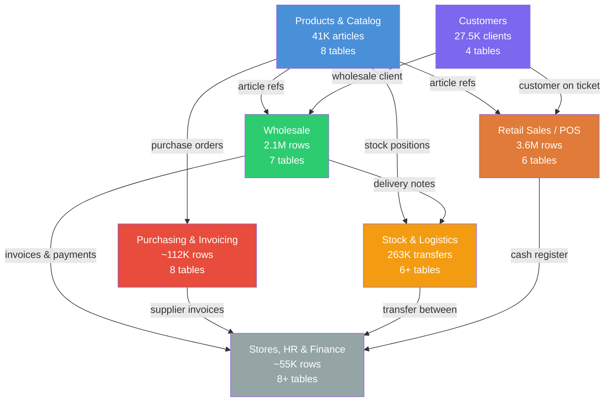

# PowerShop 4D Database Architecture

> Data architecture diagrams for the PowerShop 4D retail management database.
> Generated from schema discovery on 2026-03-26.

## Database Overview

- **Total tables**: 325
- **Tables with data**: 102
- **Total rows across key tables**: ~8,611,554

## High-Level Domain Map

## Domain Diagrams

| Domain | File | Key Tables | Total Rows | Description |
|--------|------|------------|------------|-------------|
| [Products & Catalog](products.md) | `products.md` | Articulos, FamiGrupMarc, CCStock, CCOPColores, CCOPTempTipo, CCOPMarcTrat, DepaSeccFabr, SubfamModelo | ~82,831 | Product master, classification hierarchies, stock positions |
| [Retail Sales / POS](sales.md) | `sales.md` | Ventas, LineasVentas, PagosVentas, Cajas, LCajas, Cajeros | ~3,603,442 | Point-of-sale transactions, ticket lines, payments, cash registers |
| [Customers](customers.md) | `customers.md` | Clientes, TiposClientes, GrupoClientes, OPClientes | ~27,545 | Customer master data, types, groups |
| [Wholesale](wholesale.md) | `wholesale.md` | GCPedidos, GCLinPedidos, GCAlbaranes, GCLinAlbarane, GCFacturas, GCLinFacturas, GCComerciales | ~2,058,175 | Wholesale orders, delivery notes, invoices, sales reps |
| [Purchasing & Invoicing](purchasing.md) | `purchasing.md` | Compras, LineasCompras, Proveedores, Facturas, Albaranes, LinAlbaranes, FacturasCompra, PagosCompras | ~113,849 | Purchase orders, supplier management, invoicing |
| [Stock & Logistics](stock-logistics.md) | `stock-logistics.md` | Traspasos, Movimientos, Inventarios, Logistica, PackingList, Reposiciones, BarrasAsociado, SemiCodigo | ~437,037 | Transfers, inventory, logistics, barcodes, RFID |
| [Stores, HR & Finance](stores-hr.md) | `stores-hr.md` | Tiendas, RRHHEmpleados, FormasPago, CobrosFacturas, Vales, TarjetasRegalo, CuentasBancarias | ~67,007 | Store config, employees, payment methods, vouchers |

## Key Relationships Summary

All tables use `Reg*` fields (Real/float type) as internal record identifiers (e.g., `RegArticulo`, `RegCliente`, `RegVentas`).

| From Table | From Column | To Table | To Column | Cardinality |
|-----------|-------------|----------|-----------|-------------|
| LineasVentas | NumVentas | Ventas | RegVentas | Many-to-one |
| PagosVentas | NumVentas | Ventas | RegVentas | Many-to-one |
| Articulos | NumFamilia | FamiGrupMarc | RegFamilia | Many-to-one |
| Articulos | NumDepartament | DepaSeccFabr | RegDepartament | Many-to-one |
| Articulos | NumProveedor | Proveedores | RegProveedor | Many-to-one |
| Articulos | NumColor | CCOPColores | RegColor | Many-to-one |
| Articulos | NumTemporada | CCOPTempTipo | RegTemporada | Many-to-one |
| Articulos | NumMarca | CCOPMarcTrat | RegMarca | Many-to-one |
| CCStock | NumArticulo | Articulos | RegArticulo | One-to-one |
| GCAlbaranes | NumCliente | Clientes | RegCliente | Many-to-one |
| GCLinAlbarane | NumAlbaran | GCAlbaranes | RegAlbaran | Many-to-one |
| GCFacturas | NumCliente | Clientes | RegCliente | Many-to-one |
| GCLinFacturas | NumFactura | GCFacturas | RegFactura | Many-to-one |
| Traspasos | TiendaEntrada | Tiendas | Codigo | Many-to-one |
| Clientes | NumComercial | GCComerciales | RegComercial | Many-to-one |
| CobrosFacturas | NumFactura | GCFacturas | RegFactura | Many-to-one |
| Ventas | NumCliente | Clientes | RegCliente | Many-to-one |

## Notes

- **CCStock wide format**: 582 columns -- stock quantities stored per store/size combination in a denormalized matrix.
- **Period filtering**: `LineasVentas.Mes` stores YYYYMM as integer; `PagosVentas.Mes` as text.
- **Store encoding**: `RegVentas` decimal part encodes the store code (e.g., `.153`, `.155`).
- **Multi-currency**: `Articulos.Moneda` and `PrecioDivisa` support foreign currency pricing.
- **Empty tables**: ~223 of 325 tables have zero rows; these are either unused modules or seasonal/archived data.
