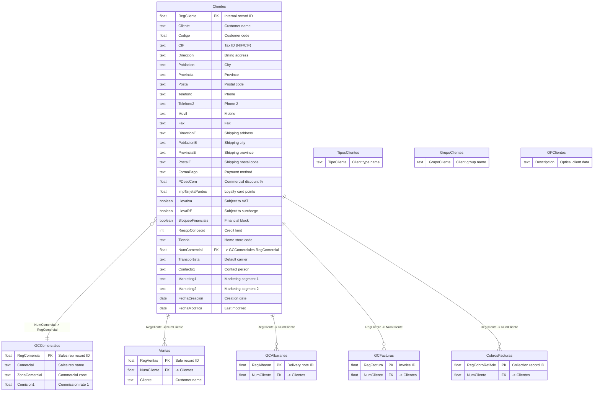

# Customers Domain

> Customer master data for both retail and wholesale channels.

## Entity Relationship Diagram

## Table Descriptions

| Table | Rows | Columns | Description |
|-------|------|---------|-------------|
| **Clientes** | 27,530 | 311 | Customer master. Stores name, billing/shipping addresses, contact info, payment terms, bank details (IBAN/BIC), credit risk, loyalty card, commercial zone, wholesale flags, and CRM/marketing fields. |
| **TiposClientes** | 15 | -- | Customer type classification (e.g., retail, wholesale, VIP). |
| **GCComerciales** | 5 | 50 | Sales representatives linked to customers. |

## Empty / Unused Tables in This Domain

| Table | Columns | Description |
|-------|---------|-------------|
| GrupoClientes | 0 | Customer groups for segmentation. Not in use. |
| OPClientes | 0 | Optical-specific customer data. Not in use. |
| CRMCampañas | 18 | CRM marketing campaigns. Not in use. |
| CRMAsociados | 0 | CRM associated contacts. Not in use. |
| CRMCargaOPPrue | 0 | CRM data loading. Not in use. |
| CRMCuestionarios | 0 | CRM questionnaires. Not in use. |
| CRMDetalleCue | 0 | CRM questionnaire details. Not in use. |
| CRMVisitados | 0 | CRM visit tracking. Not in use. |
| ValesClientes | 0 | Customer-specific vouchers. Not in use. |

## Clientes Field Groups

> Confirmed 2026-04-05 from `_USER_COLUMNS` (311 columns total, 27,530 rows in production).

| Group | Fields | Purpose |
|-------|--------|---------|
| Identity | `RegCliente` (PK), `Codigo`, `Cliente`, `NombreComercial`, `NombreFactura`, `CIF`, `Pasaporte`, `CPIDNIF` | Customer identity and tax ID |
| Billing address | `Direccion`, `Poblacion`, `Provincia`, `Postal`, `Pais` | Primary billing address |
| Shipping address | `DireccionE`, `PoblacionE`, `ProvinciaE`, `PostalE`, `PaisE` | Delivery address |
| Invoice address | `DireccionEF`, `PoblacionEF`, `ProvinciaEF`, `PostalEF`, `PaisEF` | Separate invoicing address |
| Contact | `Telefono`, `Telefono2`, `Movil`, `Fax`, `email`, `Web`, `Contacto1`, `FacebookId` | Contact methods |
| Payment | `FormaPago`, `FormaPago2..FormaPago12`, `DiaPago`, `DiaPago2`, `DiaPago1B`, `DiaPago2B` | Payment terms (up to 12 installments) |
| Banking | `BancoRemesa`, `BancoRemesa2`, `BIC`, `BIC2`, `DIBAN`, `DIBAN2`, `DAgencia`, `DAgencia2`, `DCuenta`, `DCuenta2`, `DEntidad`, `DEntidad2` | Bank account details (IBAN/BIC) for remittance |
| Credit/risk | `RiesgoConcedid`, `BloqueoFinancials`, `Deposito`, `AdmiteDeposito`, `GastoMaximo`, `EfectosA1..EfectosA12`, `EfectosC1..EfectosC12` | Credit limit and risk management |
| Loyalty | `TarjetaPuntos`, `ImpTarjetaPuntos`, `AcumulaPtosMensual`, `AcumuladoVentas`, `Wapping_ID` | Points program and Wapping integration |
| Wholesale/B2B | `Mayorista`, `B2B1Provisional..B2B4Provisional`, `ComentarioB2B`, `QuieroPDFPedidoB2B`, `AlbaranPedido`, `PFacturacion`, `CRAval`, `CRComentarios` | Wholesale-specific flags and B2B portal |
| Segmentation | `TipoCliente`, `TipoClientePromocion`, `TipoClienteSMST`, `ZonaComercial`, `ZonaLogistica`, `Marketing1..Marketing7`, `NLista` | Customer classification |
| Accounting | `CuentaContable`, `CuentaAsociada`, `LlevaIva`, `LlevaRE`, `LlevaIRPF`, `IGIC`, `CPTipoIva`, `PTTipoIva`, `GCRecargo`, `CPRecargo` | Fiscal/accounting codes |
| Optical (OPClientes) | `Medida1..Medida26`, `MedidaT1..MedidaT26`, `OPProxGraduCO`, `OPProxGraduOP`, `OPSiSeCCEti` | Optical measurements (prescription data — 26 measures + labels) |
| GDPR/Privacy | `PoliticaPrivacidad`, `FAcceptaComuni`, `FAcceptaPP`, `RecibirInfo`, `Mailing`, `NoDaDireccion`, `NoDaEmail`, `NoDaTelefono` | GDPR consent and data sharing flags |
| Dates | `FechaCreacion`, `FechaModifica`, `FechaNacimient`, `FechaFideliza`, `FechaUltiCumpleAviso`, `DiaNacimientoAnual`, `UltimaCompraF`, `UltimaCompraI` | Key dates |
| Marketplace | `ClienteMarketPlace`, `CodCliMarketPlace` | External marketplace customer ID |
| Free fields | `Libre01..Libre10`, `Libre13..Libre17`, `Libre21..Libre28`, `Libre7` | Custom/future use |
| Admin | `EnviadoCentral`, `Anulado`, `Retenido`, `CMaquina`, `MMaquina`, `Path`, `Firma`, `Fotografia` | Internal admin |

## Notes

- **Clientes** has 311 columns including: multiple address sets (billing, shipping, invoicing), up to 12 payment installment fields, bank details (Banco, Agencia, CuentaCorriente, IBAN, BIC), risk management (RiesgoConcedid, BloqueoFinancials), loyalty (ImpTarjetaPuntos), and extensive CRM fields.
- The same `Clientes` table serves both retail POS customers (linked via `Ventas.NumCliente`) and wholesale clients (linked via `GCAlbaranes.NumCliente`, `GCFacturas.NumCliente`).
- **Wholesale flag confirmed**: `Mayorista` boolean field distinguishes B2B wholesale customers from B2C retail. `B2B1..B2B4Provisional` flags track provisional B2B portal access levels.
- **GCComerciales** links customers to sales representatives via `Clientes.NumComercial -> GCComerciales.RegComercial`.
- **Optical module**: `Medida1..Medida26` + `MedidaT1..MedidaT26` store 26 optical prescription measurements per customer (eyeglass prescriptions). Label slots (MedidaT*) contain measurement names.
- **Wapping**: `Wapping_ID` links the customer to the Wapping omnichannel loyalty platform.
- **GDPR**: `PoliticaPrivacidad` (policy accepted), `FAcceptaComuni` (date accepted communications), `FAcceptaPP` (date accepted privacy policy) are GDPR consent fields — required for marketing.
- The CRM module (CRMCampañas, CRMVisitados, etc.) exists in the schema but is completely empty.
