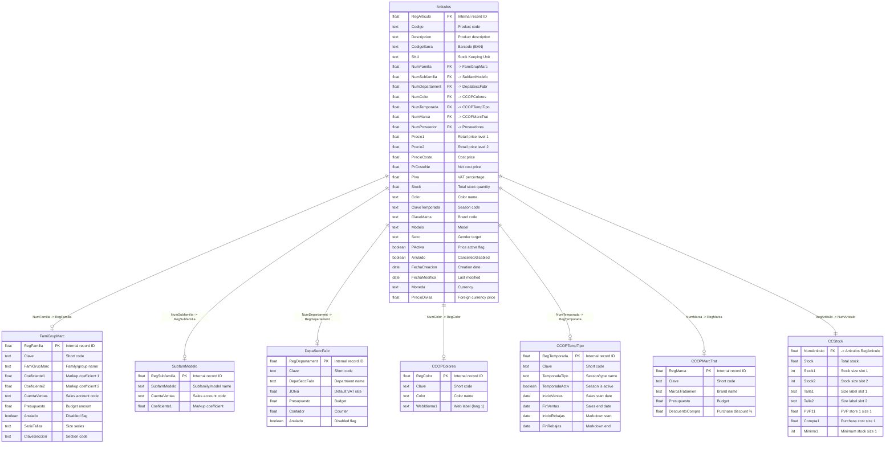

# Products & Catalog Domain

> Product master data, classification hierarchies, and stock positions.

## Entity Relationship Diagram

## Table Descriptions

| Table | Rows | Columns | Description |
|-------|------|---------|-------------|
| **Articulos** | 41,215 | 379 | Product/article master. Each row is a unique SKU with pricing (15 price levels), cost, VAT, barcodes, classification keys, web flags, sizes, and images. |
| **FamiGrupMarc** | 77 | 112 | Product families/groups/brands. Hierarchical categorization (e.g., CAMISA, ABRIGO). |
| **DepaSeccFabr** | 10 | 76 | Top-level departments/sections/manufacturers (10 entries). |
| **CCOPColores** | 96 | 35 | Color catalog. Master list of product colors. |
| **CCOPTempTipo** | 69 | 75 | Seasons and product types. Temporal classification for collections. |
| **CCOPMarcTrat** | 147 | 63 | Brands and treatments. Brand classification. |
| **CCStock** | 41,217 | 582 | Stock positions per article in wide format -- columns per store/size combination. |

## Empty / Unused Tables in This Domain

| Table | Columns | Description |
|-------|---------|-------------|
| SubfamModelo | 47 | Subfamilies and models (second-level classification). Currently empty. |

## Notes

- **Articulos** has 379 columns; most are repeating patterns for sizes (Medida1-20), prices (Precio1-15), markdowns (Rebajas1-15), coefficients (Coef1-15), and multilingual descriptions (Idioma1-10).
- **CCStock** uses a wide-format layout with 582 columns: `Stock1..Stock34` (stock per size slot), `Talla1..Talla34` (size labels), `PVP1..PVP7 x 34` (prices per tariff per size), `Minimo1..Minimo34`, `Compra1..Compra34`, `Rebaja1..Rebaja2 x 34`, `Ubicacion1..Ubicacion3 x 34`, and `Anulada1..Anulada34`.
- Classification hierarchy: **DepaSeccFabr** (department) -> **FamiGrupMarc** (family) -> **SubfamModelo** (subfamily). Cross-classified by **CCOPMarcTrat** (brand), **CCOPTempTipo** (season), and **CCOPColores** (color).
- Related tables in other domains: `Proveedores` (purchasing), `LineasVentas` and `GCLinAlbarane` reference `NumArticulo`.
