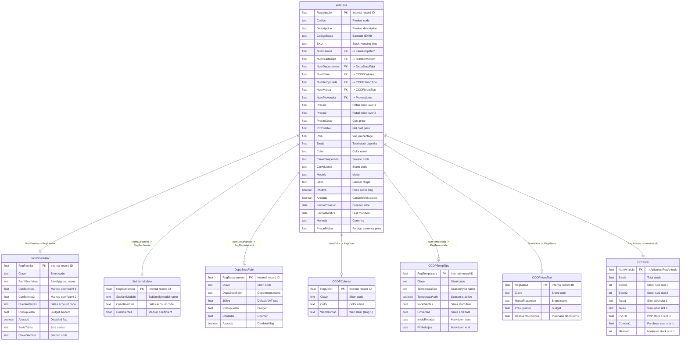

# Products & Catalog Domain

> Product master data, classification hierarchies, and stock positions.

## Entity Relationship Diagram


```mermaid
erDiagram
    Articulos {
        float RegArticulo PK "Internal record ID"
        text Codigo "Product code"
        text Descripcion "Product description"
        text CodigoBarra "Barcode (EAN)"
        text SKU "Stock Keeping Unit"
        float NumFamilia FK "-> FamiGrupMarc"
        float NumSubfamilia FK "-> SubfamModelo"
        float NumDepartament FK "-> DepaSeccFabr"
        float NumColor FK "-> CCOPColores"
        float NumTemporada FK "-> CCOPTempTipo"
        float NumMarca FK "-> CCOPMarcTrat"
        float NumProveedor FK "-> Proveedores"
        float Precio1 "Retail price level 1"
        float Precio2 "Retail price level 2"
        float PrecioCoste "Cost price"
        float PrCosteNe "Net cost price"
        float PIva "VAT percentage"
        float Stock "Total stock quantity"
        text Color "Color name"
        text ClaveTemporada "Season code"
        text ClaveMarca "Brand code"
        text Modelo "Model"
        text Sexo "Gender target"
        boolean PActiva "Price active flag"
        boolean Anulado "Cancelled/disabled"
        date FechaCreacion "Creation date"
        date FechaModifica "Last modified"
        text Moneda "Currency"
        float PrecioDivisa "Foreign currency price"
    }

    FamiGrupMarc {
        float RegFamilia PK "Internal record ID"
        text Clave "Short code"
        text FamiGrupMarc "Family/group name"
        float Coeficiente1 "Markup coefficient 1"
        float Coeficiente2 "Markup coefficient 2"
        text CuentaVentas "Sales account code"
        float Presupuesto "Budget amount"
        boolean Anulado "Disabled flag"
        text SerieTallas "Size series"
        text ClaveSeccion "Section code"
    }

    SubfamModelo {
        float RegSubfamilia PK "Internal record ID"
        text SubfamModelo "Subfamily/model name"
        text CuentaVentas "Sales account code"
        float Coeficiente1 "Markup coefficient"
    }

    DepaSeccFabr {
        float RegDepartament PK "Internal record ID"
        text Clave "Short code"
        text DepaSeccFabr "Department name"
        float JOIva "Default VAT rate"
        float Presupuesto "Budget"
        float Contador "Counter"
        boolean Anulado "Disabled flag"
    }

    CCOPColores {
        float RegColor PK "Internal record ID"
        text Clave "Short code"
        text Color "Color name"
        text WebIdioma1 "Web label (lang 1)"
    }

    CCOPTempTipo {
        float RegTemporada PK "Internal record ID"
        text Clave "Short code"
        text TemporadaTipo "Season/type name"
        boolean TemporadaActiv "Season is active"
        date InicioVentas "Sales start date"
        date FinVentas "Sales end date"
        date InicioRebajas "Markdown start"
        date FinRebajas "Markdown end"
    }

    CCOPMarcTrat {
        float RegMarca PK "Internal record ID"
        text Clave "Short code"
        text MarcaTratamien "Brand name"
        float Presupuesto "Budget"
        float DescuentoCompra "Purchase discount %"
    }

    CCStock {
        float NumArticulo FK "-> Articulos.RegArticulo"
        float Stock "Total stock"
        int Stock1 "Stock size slot 1"
        int Stock2 "Stock size slot 2"
        text Talla1 "Size label slot 1"
        text Talla2 "Size label slot 2"
        float PVP11 "PVP store 1 size 1"
        float Compra1 "Purchase cost size 1"
        int Minimo1 "Minimum stock size 1"
    }

    Articulos ||--o| FamiGrupMarc : "NumFamilia -> RegFamilia"
    Articulos ||--o| SubfamModelo : "NumSubfamilia -> RegSubfamilia"
    Articulos ||--o| DepaSeccFabr : "NumDepartament -> RegDepartament"
    Articulos ||--o| CCOPColores : "NumColor -> RegColor"
    Articulos ||--o| CCOPTempTipo : "NumTemporada -> RegTemporada"
    Articulos ||--o| CCOPMarcTrat : "NumMarca -> RegMarca"
    Articulos ||--|| CCStock : "RegArticulo -> NumArticulo"
```

## Table Descriptions

| Table | Rows | Columns | Description |
|-------|------|---------|-------------|
| **Articulos** | 41,215 | 379 | Product/article master. Each row is a unique SKU with pricing (15 price levels), cost, VAT, barcodes, classification keys, web flags, sizes, and images. |
| **FamiGrupMarc** | 77 | 112 | Product families/groups/brands. Hierarchical categorization (e.g., CAMISA, ABRIGO). |
| **DepaSeccFabr** | 10 | 76 | Top-level departments/sections/manufacturers (10 entries). |
| **CCOPColores** | 96 | 35 | Color catalog. Master list of product colors. |
| **CCOPTempTipo** | 69 | 75 | Seasons and product types. Temporal classification for collections. |
| **CCOPMarcTrat** | 147 | 63 | Brands and treatments. Brand classification. |
| **CCStock** | 41,217 | 582 | Stock positions per article in wide format -- columns per store/size combination. |

## Empty / Unused Tables in This Domain

| Table | Columns | Description |
|-------|---------|-------------|
| SubfamModelo | 47 | Subfamilies and models (second-level classification). Currently empty. |

## Notes

- **Articulos** has 379 columns; most are repeating patterns for sizes (Medida1-20), prices (Precio1-15), markdowns (Rebajas1-15), coefficients (Coef1-15), and multilingual descriptions (Idioma1-10).
- **CCStock** uses a wide-format layout with 582 columns: `Stock1..Stock34` (stock per size slot), `Talla1..Talla34` (size labels), `PVP1..PVP7 x 34` (prices per tariff per size), `Minimo1..Minimo34`, `Compra1..Compra34`, `Rebaja1..Rebaja2 x 34`, `Ubicacion1..Ubicacion3 x 34`, and `Anulada1..Anulada34`.
- Classification hierarchy: **DepaSeccFabr** (department) -> **FamiGrupMarc** (family) -> **SubfamModelo** (subfamily). Cross-classified by **CCOPMarcTrat** (brand), **CCOPTempTipo** (season), and **CCOPColores** (color).
- Related tables in other domains: `Proveedores` (purchasing), `LineasVentas` and `GCLinAlbarane` reference `NumArticulo`.

## FamiGrupMarc Field Groups

> Confirmed 2026-04-05 from `_USER_COLUMNS` (112 columns total, 78 rows in production).

| Group | Fields | Purpose |
|-------|--------|---------|
| Identity | `RegFamilia` (PK), `Clave`, `FamiGrupMarc`, `CodigoGenerico`, `Codigo1..Codigo6` | Family ID and short codes |
| Accounting | `CuentaVentas`, `CuentaVentas2`, `Presupuesto`, `Comision`, `Coeficiente1..Coeficiente4` | Sales accounts, budget, markup |
| Section/Dept | `ClaveSeccion`, `Seccion1..Seccion6`, `SerieEmpresa` | Cross-reference to DepaSeccFabr sections |
| Size series | `SerieTallas` | **Dead end — not the size series source.** Blank in all 78 production rows, and structurally wrong: the series hangs off the *article*, via `Articulos.ClaveSerie` → `CCOPSeriCali.Clave`. See the gotcha below. |
| Promotions | `PrecioPromocion`, `PorcenPromocion`, `PromoDesde`, `PromoHasta`, `UnidadPromocion`, `ValeCliente` | Promotional pricing |
| Web/Commerce | `NoPSCloud`, `NoPSCommerce`, `NoPSCommerceM`, `PathPSCloud`, `WebIdioma1..WebIdioma5`, `Weborden` | E-commerce visibility |
| Brand integrations | `CATAdidasMat1..10` (Adidas material codes), `CATNikeModel21/22`, `CATNikeStyleC1..3` | Third-party catalog mapping |
| Volume/loyalty | `VolumenImporte`, `VolumenNumero`, `VolumenPorcen`, `VolumenVale`, `GrupoClientes` | Volume discount and loyalty rules |
| Unit pricing | `Unidades1..Unidades6`, `Unidad1Imp..Unidad3Imp`, `Unidad1Por..Unidad3Por`, `UsarPVPUnidad2`, `STUnidad2` | Multi-unit pricing (e.g., pairs, sets) |
| Stock special | `ST2X1`, `STVolumen`, `OPIncremento`, `NoPSCloud`, `AenaEsRentaUni`, `AenaRentaConIVA` | Stock/rental special rules |
| Free fields | `Libre01..Libre10` | Custom use |
| Metadata | `FModifica`, `HModifica`, `Anulado`, `Contador`, `Historico1..Historico4`, `CorrectorMDV` | Admin fields |

> **Key gotcha — the size series is `Articulos.ClaveSerie`, not `FamiGrupMarc.SerieTallas`.**
> The canonical definition of an article's size run is:
> **`Articulos.ClaveSerie` → `CCOPSeriCali.Clave` → `CCOPSeriCali.Talla1..Talla34`** (that table has 219 columns; the 34 `Talla*` slots hold the size labels).
>
> `FamiGrupMarc.SerieTallas` is blank in all 78 production rows — but "it's blank" was the wrong reason to close this question. The field is not merely unpopulated, it is at the wrong grain: the series belongs to the **article**, not the family, so two articles in the same family can carry different size runs. An earlier revision of this file concluded "use the literal labels from `Exportaciones`/`GCLinPedidos`" and stopped there, which works by accident for those two tables and leaves you with no answer for any article that does not appear in them.
>
> Neither `Articulos.ClaveSerie` nor `CCOPSeriCali` is mirrored into PostgreSQL. For queries against the mirror the size labels do already come resolved in `ps_stock_tienda.talla` and `ps_traspasos.talla` — use those. Go to `ClaveSerie` → `CCOPSeriCali` when working against 4D directly, or when you need an article's full size run including sizes it has no stock rows for.

> **Key gotcha — `CCRefeJOFACM` is reference+colour, not the model.** The last 2 characters are the colour code. Grouping a "top articles" ranking by `ccrefejofacm` splits one model across several rows: production holds 42,244 distinct `ccrefejofacm` values against only 19,941 models — 2.12 colours per model on average (measured 2026-08). A model that sells well can miss the top-N entirely because its volume is spread over its colours. Group by `LEFT(ccrefejofacm, LENGTH(ccrefejofacm) - 2)` to rank by model. Real example: `75221411`, `75221420`, `75221421`, `75221470`, `75221490`, `75221496` are six colours of model `752214`. Use the raw `ccrefejofacm` only when the colour breakdown is what was actually asked for.

> **Brand integrations:** `CATAdidasMat1..10` and `CATNikeModel/Style` fields map product families to Adidas and Nike catalog codes for data feed exports. These are the "ADIDAS data feeds" and "corners/concessions" modules discovered in D-011.

## ETL Sync Strategy

> Validated against production data 2026-03-30.

All product/catalog tables use **full refresh nightly** (truncate + insert).

| Table | Rows | Reason for full refresh |
|-------|------|------------------------|
| Articulos | 41,264 | All 41K records have `FechaModifica >= 2025-03-26` due to a batch update — delta is ineffective |
| FamiGrupMarc | 78 | Trivially small |
| DepaSeccFabr | 10 | Trivially small |
| CCOPColores | 99 | Trivially small |
| CCOPTempTipo | 69 | Trivially small |
| CCOPMarcTrat | ~147 | Trivially small |

**Articulos column selection:** Do NOT use `SELECT *`. The 379 columns include BLOB/PICTURE types (DATA_TYPE 12 and 18) that slow queries. Select only the ~30–40 business-relevant columns explicitly.

See [etl-sync-strategy.md](../etl-sync-strategy.md) for the full sync plan.

---

## LLM:tables

```json
[
  {
    "table": "ps_articulos",
    "alias": "Producto",
    "description": "Catálogo de productos. ccrefejofacm=Referencia REFERENCIA+COLOR (los 2 ultimos caracteres son el color): para rankear por MODELO agrupar por LEFT(ccrefejofacm, LENGTH(ccrefejofacm)-2). M=mayorista, MA=material (excluido del ETL).",
    "keyColumns": ["reg_articulo (PK)", "codigo", "ccrefejofacm (Referencia = modelo+color; NO es el modelo)", "descripcion", "num_familia (FK)", "num_departament (FK)", "num_color (FK)", "num_temporada (FK)", "num_marca (FK)", "precio_coste", "p_iva", "anulado", "fecha_creacion", "clave_temporada", "modelo", "sexo"]
  },
  {
    "table": "ps_familias",
    "alias": "Familia",
    "description": "Familias/grupos de productos.",
    "keyColumns": ["reg_familia (PK)", "fami_grup_marc"]
  },
  {
    "table": "ps_departamentos",
    "alias": "Departamento",
    "description": "Departamentos/secciones.",
    "keyColumns": ["reg_departament (PK)", "depa_secc_fabr"]
  },
  {
    "table": "ps_colores",
    "alias": "Color",
    "description": "Catálogo de colores.",
    "keyColumns": ["reg_color (PK)", "color"]
  },
  {
    "table": "ps_temporadas",
    "alias": "Temporada",
    "description": "Temporadas y tipos.",
    "keyColumns": ["reg_temporada (PK)", "temporada_tipo"]
  },
  {
    "table": "ps_marcas",
    "alias": "Marca",
    "description": "Marcas de producto.",
    "keyColumns": ["reg_marca (PK)", "marca"]
  }
]
```

## LLM:relationships

```json
[
  {"from": "ps_articulos", "fromColumn": "num_familia", "to": "ps_familias", "toColumn": "reg_familia", "type": "MANY_TO_ONE"},
  {"from": "ps_articulos", "fromColumn": "num_departament", "to": "ps_departamentos", "toColumn": "reg_departament", "type": "MANY_TO_ONE"},
  {"from": "ps_articulos", "fromColumn": "num_color", "to": "ps_colores", "toColumn": "reg_color", "type": "MANY_TO_ONE"},
  {"from": "ps_articulos", "fromColumn": "num_temporada", "to": "ps_temporadas", "toColumn": "reg_temporada", "type": "MANY_TO_ONE"},
  {"from": "ps_articulos", "fromColumn": "num_marca", "to": "ps_marcas", "toColumn": "reg_marca", "type": "MANY_TO_ONE"}
]
```
