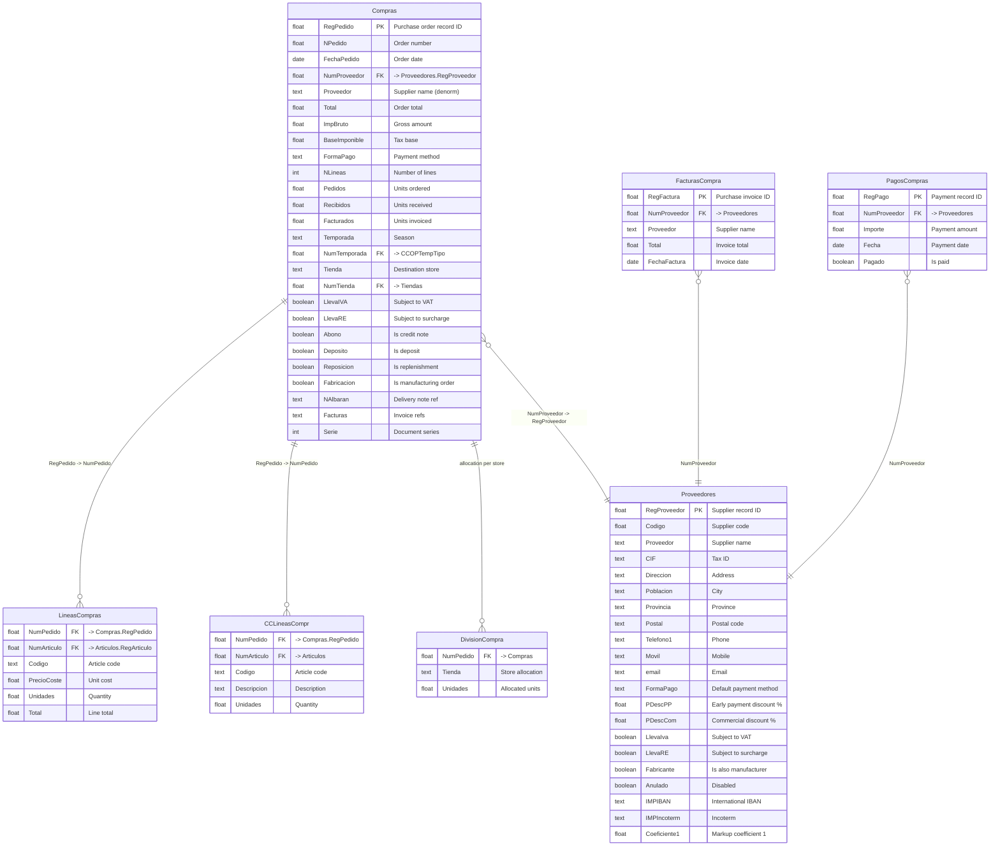
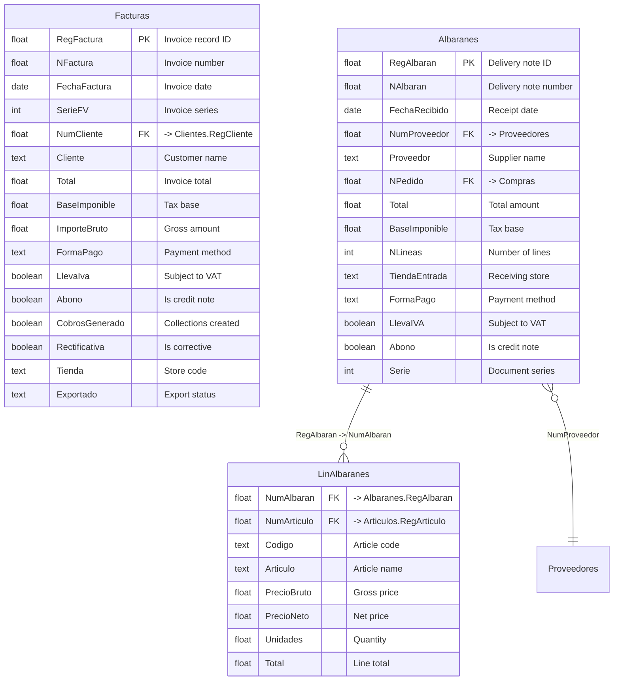

# Purchasing & Invoicing Domain

> Purchase orders, supplier management, retail invoicing, and delivery notes.

## Entity Relationship Diagram -- Purchasing

## Entity Relationship Diagram -- Retail Invoicing

## Table Descriptions

| Table | Rows | Columns | Description |
|-------|------|---------|-------------|
| **Compras** | 2,697 | 129 | Purchase orders to suppliers. Contains totals, VAT, payment terms, season, and fulfillment status. |
| **LineasCompras** | 0 | 57 | Purchase order line items. Currently empty (see CCLineasCompr). |
| **CCLineasCompr** | 44,395 | -- | Alternative purchase line items table (populated). |
| **Proveedores** | 518 | 115 | Supplier master. Address, contacts, bank, payment terms, import terms (Incoterm, IBAN). |
| **FacturasCompra** | 3,884 | -- | Purchase invoices from suppliers. |
| **PagosCompras** | 11,415 | -- | Payments to suppliers. |
| **DivisionCompra** | 10,981 | -- | Purchase order allocation across stores. |
| **Facturas** | 2,356 | 118 | Retail invoices. Formal fiscal documents from POS sales with TBAI/SAFT compliance. |
| **Albaranes** | 3,669 | 68 | Retail delivery notes for goods received from suppliers. |
| **LinAlbaranes** | 44,335 | 109 | Line items on delivery notes with size-level detail (Talla1-17). |

## Empty / Unused Tables

| Table | Description |
|-------|-------------|
| LineasCompras | Purchase order lines (empty -- CCLineasCompr is used instead) |
| CargosProveedores | Supplier charges |
| ComprasExternas | External purchases |
| OFFComprasDetail | Offline purchase details |
| OFFComprasHeader | Offline purchase headers |
| STDivisionCompra | Stock division for purchases |

## Notes

- **Two purchase line tables exist**: `LineasCompras` (empty, 57 cols) and `CCLineasCompr` (44,395 rows). The CC-prefixed version appears to be the active one.
- **Purchase flow**: Compras (order) -> Albaranes (receipt) -> FacturasCompra (supplier invoice) -> PagosCompras (payment).
- **Retail invoicing**: `Facturas` are formal invoices generated from POS sales (Ventas), separate from wholesale invoices (GCFacturas).
- **LinAlbaranes** has size-level columns (Talla1-17) matching the CCStock wide format for receiving goods per size.
- **DivisionCompra** (10,981 rows) tracks how purchase orders are allocated across multiple stores.
- Proveedores links to Articulos via `Articulos.NumProveedor -> Proveedores.RegProveedor`.
