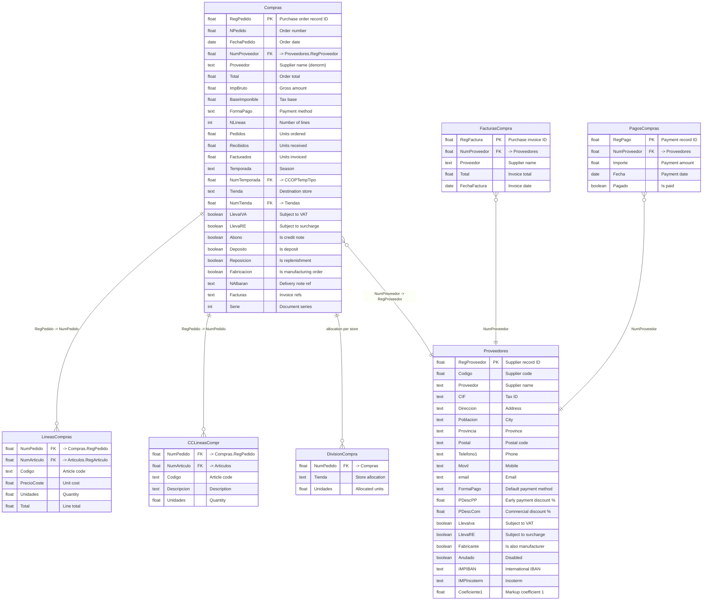
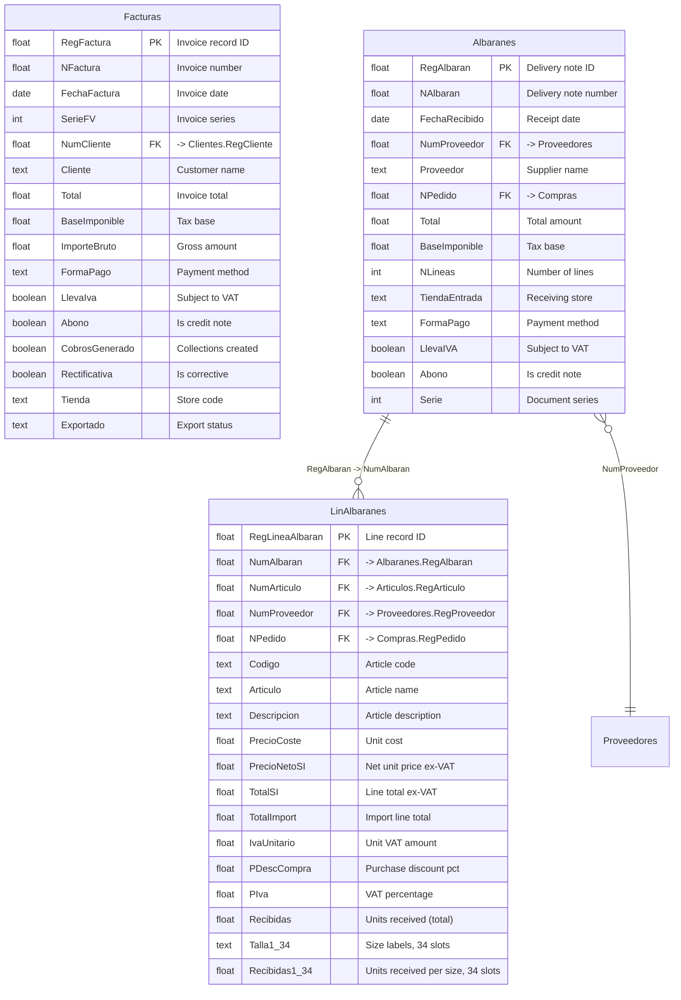

# Purchasing & Invoicing Domain

> Purchase orders, supplier management, retail invoicing, and delivery notes.

## Entity Relationship Diagram -- Purchasing


```mermaid
erDiagram
    Compras {
        float RegPedido PK "Purchase order record ID"
        float NPedido "Order number"
        date FechaPedido "Order date"
        float NumProveedor FK "-> Proveedores.RegProveedor"
        text Proveedor "Supplier name (denorm)"
        float Total "Order total"
        float ImpBruto "Gross amount"
        float BaseImponible "Tax base"
        text FormaPago "Payment method"
        int NLineas "Number of lines"
        float Pedidos "Units ordered"
        float Recibidos "Units received"
        float Facturados "Units invoiced"
        text Temporada "Season"
        float NumTemporada FK "-> CCOPTempTipo"
        text Tienda "Destination store"
        float NumTienda FK "-> Tiendas"
        boolean LlevaIVA "Subject to VAT"
        boolean LlevaRE "Subject to surcharge"
        boolean Abono "Is credit note"
        boolean Deposito "Is deposit"
        boolean Reposicion "Is replenishment"
        boolean Fabricacion "Is manufacturing order"
        text NAlbaran "Delivery note ref"
        text Facturas "Invoice refs"
        int Serie "Document series"
    }

    LineasCompras {
        float NumPedido FK "-> Compras.RegPedido"
        float NumArticulo FK "-> Articulos.RegArticulo"
        text Codigo "Article code"
        float PrecioCoste "Unit cost"
        float Unidades "Quantity"
        float Total "Line total"
    }

    Proveedores {
        float RegProveedor PK "Supplier record ID"
        float Codigo "Supplier code"
        text Proveedor "Supplier name"
        text CIF "Tax ID"
        text Direccion "Address"
        text Poblacion "City"
        text Provincia "Province"
        text Postal "Postal code"
        text Telefono1 "Phone"
        text Movil "Mobile"
        text email "Email"
        text FormaPago "Default payment method"
        float PDescPP "Early payment discount %"
        float PDescCom "Commercial discount %"
        boolean LlevaIva "Subject to VAT"
        boolean LlevaRE "Subject to surcharge"
        boolean Fabricante "Is also manufacturer"
        boolean Anulado "Disabled"
        text IMPIBAN "International IBAN"
        text IMPIncoterm "Incoterm"
        float Coeficiente1 "Markup coefficient 1"
    }

    CCLineasCompr {
        float NumPedido FK "-> Compras.RegPedido"
        float NumArticulo FK "-> Articulos"
        text Codigo "Article code"
        text Descripcion "Description"
        float Unidades "Quantity"
    }

    FacturasCompra {
        float RegFactura PK "Purchase invoice ID"
        float NumProveedor FK "-> Proveedores"
        text Proveedor "Supplier name"
        float Total "Invoice total"
        date FechaFactura "Invoice date"
    }

    PagosCompras {
        float RegPago PK "Payment record ID"
        float NumProveedor FK "-> Proveedores"
        float Importe "Payment amount"
        date Fecha "Payment date"
        boolean Pagado "Is paid"
    }

    DivisionCompra {
        float NumPedido FK "-> Compras"
        text Tienda "Store allocation"
        float Unidades "Allocated units"
    }

    Compras ||--o{ LineasCompras : "RegPedido -> NumPedido"
    Compras ||--o{ CCLineasCompr : "RegPedido -> NumPedido"
    Compras ||--o{ DivisionCompra : "allocation per store"
    Compras }o--|| Proveedores : "NumProveedor -> RegProveedor"
    FacturasCompra }o--|| Proveedores : "NumProveedor"
    PagosCompras }o--|| Proveedores : "NumProveedor"
```

## Entity Relationship Diagram -- Retail Invoicing


```mermaid
erDiagram
    Facturas {
        float RegFactura PK "Invoice record ID"
        float NFactura "Invoice number"
        date FechaFactura "Invoice date"
        int SerieFV "Invoice series"
        float NumCliente FK "-> Clientes.RegCliente"
        text Cliente "Customer name"
        float Total "Invoice total"
        float BaseImponible "Tax base"
        float ImporteBruto "Gross amount"
        text FormaPago "Payment method"
        boolean LlevaIva "Subject to VAT"
        boolean Abono "Is credit note"
        boolean CobrosGenerado "Collections created"
        boolean Rectificativa "Is corrective"
        text Tienda "Store code"
        text Exportado "Export status"
    }

    Albaranes {
        float RegAlbaran PK "Delivery note ID"
        float NAlbaran "Delivery note number"
        date FechaRecibido "Receipt date"
        float NumProveedor FK "-> Proveedores"
        text Proveedor "Supplier name"
        float NPedido FK "-> Compras"
        float Total "Total amount"
        float BaseImponible "Tax base"
        int NLineas "Number of lines"
        text TiendaEntrada "Receiving store"
        text FormaPago "Payment method"
        boolean LlevaIVA "Subject to VAT"
        boolean Abono "Is credit note"
        int Serie "Document series"
    }

    LinAlbaranes {
        float RegLineaAlbaran PK "Line record ID"
        float NumAlbaran FK "-> Albaranes.RegAlbaran"
        float NumArticulo FK "-> Articulos.RegArticulo"
        float NumProveedor FK "-> Proveedores.RegProveedor"
        float NPedido FK "-> Compras.RegPedido"
        text Codigo "Article code"
        text Articulo "Article name"
        text Descripcion "Article description"
        float PrecioCoste "Unit cost"
        float PrecioNetoSI "Net unit price ex-VAT"
        float TotalSI "Line total ex-VAT"
        float TotalImport "Import line total"
        float IvaUnitario "Unit VAT amount"
        float PDescCompra "Purchase discount pct"
        float PIva "VAT percentage"
        float Recibidas "Units received (total)"
        text Talla1_34 "Size labels, 34 slots"
        float Recibidas1_34 "Units received per size, 34 slots"
    }

    Albaranes ||--o{ LinAlbaranes : "RegAlbaran -> NumAlbaran"
    Albaranes }o--|| Proveedores : "NumProveedor"
```

## Table Descriptions

| Table | Rows | Columns | Description |
|-------|------|---------|-------------|
| **Compras** | 2,697 | 129 | Purchase orders to suppliers. Contains totals, VAT, payment terms, season, and fulfillment status. |
| **LineasCompras** | 0 | 57 | Purchase order line items. **The table exists** but is empty — the populated equivalent is `CCLineasCompr`. |
| **CCLineasCompr** | 44,395 | -- | Alternative purchase line items table (populated). |
| **Proveedores** | 518 | 115 | Supplier master. Address, contacts, bank, payment terms, import terms (Incoterm, IBAN). |
| **FacturasCompra** | 3,884 | -- | Purchase invoices from suppliers. |
| **PagosCompras** | 11,415 | -- | Payments to suppliers. |
| **DivisionCompra** | 10,981 | -- | Purchase order allocation across stores. |
| **Facturas** | 2,356 | 118 | Retail invoices. Formal fiscal documents from POS sales with TBAI/SAFT compliance. |
| **Albaranes** | 3,669 | 68 | Retail delivery notes for goods received from suppliers. |
| **LinAlbaranes** | 44,335 | 109 | Line items on delivery notes with size-level detail: `Talla1..34` (labels) + `Recibidas1..34` (units received per size). |

## Empty / Unused Tables

| Table | Description |
|-------|-------------|
| LineasCompras | Purchase order lines (empty -- CCLineasCompr is used instead) |
| CargosProveedores | Supplier charges |
| ComprasExternas | External purchases |
| OFFComprasDetail | Offline purchase details |
| OFFComprasHeader | Offline purchase headers |
| STDivisionCompra | Stock division for purchases |

## Notes

- **Two purchase line tables exist**: `LineasCompras` (exists, 57 cols, 0 rows) and `CCLineasCompr` (44,395 rows). The CC-prefixed version is the active one. `LineasCompras` **is a real table** — do not repeat the claim that it "does not exist"; it is simply empty.
- **Purchase flow**: Compras (order) -> Albaranes (receipt) -> FacturasCompra (supplier invoice) -> PagosCompras (payment).
- **Retail invoicing**: `Facturas` are formal invoices generated from POS sales (Ventas), separate from wholesale invoices (GCFacturas).
- **LinAlbaranes has 34 size slots, not 17.** Verified against 4D `_USER_COLUMNS` (109 columns total): `Talla1..Talla34` (size labels) **and** `Recibidas1..Recibidas34` (units received per size) — 68 of the 109 columns. The "Talla1-17" that used to appear here was the loop bound of a legacy Visual FoxPro report, copied into this doc as if it were the schema. Anything iterating sizes must go to 34 or it silently drops the tail of the size run.
- **LinAlbaranes money/quantity columns** (verified, not guessed): `PrecioCoste`, `PrecioNetoSI`, `TotalSI`, `TotalImport`, `IvaUnitario`, `PDescCompra`, `PIva`, `Recibidas`. There is **no** `PrecioBruto`, `PrecioNeto`, `Unidades` or `Total` on this table — those names were invented in an earlier revision of this file.
- **Purchases are `Albaranes` + `LinAlbaranes`, not `Compras` + `LineasCompras`.** `Compras`/`CCLineasCompr` are *orders* (what was asked for); `Albaranes`/`LinAlbaranes` are *goods actually received*. Any "what did we buy" analysis must use the delivery-note pair — the order pair overstates, because orders get cancelled and partially served. `LineasCompras` itself is empty in production.
- **DivisionCompra** (10,981 rows) tracks how purchase orders are allocated across multiple stores.
- Proveedores links to Articulos via `Articulos.NumProveedor -> Proveedores.RegProveedor`.

## Field Discoveries (confirmed via _USER_COLUMNS, 2026-05-01)

### CCLineasCompr (→ ps_lineas_compras)
All confirmed `DATA_TYPE=6` (Real, 8 bytes):
- `Unidades` — quantity ordered (maps to `ps_lineas_compras.unidades`)
- `PrecioCoste` — unit cost (maps to `precio_coste`)
- `PrecioNetoSI` — net unit price ex-VAT (maps to `precio_neto_si`)
- `TotalSI` — line total ex-VAT (maps to `total_si`)
- `NumProveedor` — FK → Proveedores.RegProveedor (maps to `num_proveedor`)

### Albaranes (→ ps_albaranes)
All confirmed `DATA_TYPE=6` (Real) or `DATA_TYPE=10` (text):
- `NPedido` (Real) — FK → Compras.RegPedido (maps to `num_pedido`)
- `NumProveedor` (Real) — FK → Proveedores.RegProveedor (maps to `num_proveedor`)
- `Proveedor` (text, 100 chars) — denormalised supplier name (maps to `proveedor`)

### Proveedores (→ ps_proveedores)
- `Proveedor` (text, 100 chars) — **the actual supplier name**. Maps to `ps_proveedores.nombre`.
- `NombreComercial` (text, 160 chars) — **empty for all 520 rows** in 4D. Do NOT map this field to `nombre`.
- `Codigo` (Real) — supplier code (not mapped to mirror currently).

---

## LLM:tables

```json
[
  {
    "table": "ps_compras",
    "alias": "PedidoCompra",
    "description": "Pedidos de compra a proveedores. La fecha del pedido es fecha_pedido (NO fecha_creacion). fecha_recibido es NULL mientras el pedido está pendiente de recibir.",
    "keyColumns": ["reg_pedido (PK)", "num_proveedor (FK)", "fecha_pedido", "fecha_recibido", "modificada"]
  },
  {
    "table": "ps_lin_albaranes",
    "alias": "LineaAlbaranCompra",
    "description": "Lineas de albaran de COMPRA en formato largo: una fila por linea y TALLA. Es la mercancia RECIBIDA, no confundir con ps_lineas_compras, que son PEDIDOS. 291.068 filas desde 45.967 lineas de origen (medido 2026-08-30). recibidas son las unidades de esa talla; recibidas_total es la raiz de la linea y equivale a la suma de sus tallas (cuadra en 45.966 de 45.967 lineas). Las tallas van en MAYUSCULAS, igual que ps_lineas_ventas.talla y ps_stock_tienda.talla, asi que un cruce compras-ventas-stock por talla casa sin normalizar. La talla U es talla unica y acumula el 75 % de las unidades: excluirla en cualquier ranking de tallas. La marca de devolucion al proveedor esta en la LINEA (abono); ps_albaranes, la cabecera, NO tiene columna abono.",
    "keyColumns": [
      "reg_linea_albaran (PK junto con talla)",
      "talla (PK)",
      "num_albaran (FK → ps_albaranes.reg_albaran)",
      "codigo (FK → ps_articulos.codigo)",
      "recibidas",
      "recibidas_total",
      "precio_coste",
      "total_si",
      "abono"
    ]
  },
  {
    "table": "ps_lineas_compras",
    "alias": "LineaPedidoCompra",
    "description": "Líneas de pedido de compra. NOTA: NO tiene columna `codigo` — el artículo se referencia por `num_articulo` (FK NUMERIC) y la tienda por `num_tienda`. SÍ tiene `unidades`, `precio_coste`, `precio_neto_si` y `total_si`: una revisión anterior de esta nota decía que `unidades` no existía y era falso (verificado 2026-08-31), lo que llevaba al modelo a evitar una columna que funciona. Columnas reales: reg_linea_compra, num_pedido, num_tienda, fecha, num_articulo, unidades, precio_coste, precio_neto_si, total_si, num_proveedor.",
    "keyColumns": ["reg_linea_compra (PK)", "num_pedido (FK → ps_compras.reg_pedido)", "num_tienda (FK)", "num_articulo (FK)", "fecha"]
  },
  {
    "table": "ps_albaranes",
    "alias": "AlbaranRecepcion",
    "description": "Albaranes de recepción de mercancía. La fecha de recepción es fecha_recibido (NO fecha_creacion).",
    "keyColumns": ["reg_albaran (PK)", "fecha_recibido", "modificada"]
  },
  {
    "table": "ps_facturas_compra",
    "alias": "FacturaCompra",
    "description": "Facturas de compra a proveedores.",
    "keyColumns": ["reg_factura (PK)"]
  },
  {
    "table": "ps_proveedores",
    "alias": "Proveedor",
    "description": "Proveedores de mercancía.",
    "keyColumns": ["reg_proveedor (PK)", "nombre"]
  }
]
```

## LLM:relationships

```json
[
  {"from": "ps_lineas_compras", "fromColumn": "num_pedido",    "to": "ps_compras",      "toColumn": "reg_pedido",     "type": "MANY_TO_ONE"},
  {"from": "ps_compras",        "fromColumn": "num_proveedor", "to": "ps_proveedores",  "toColumn": "reg_proveedor",  "type": "MANY_TO_ONE"},
  {"from": "ps_lin_albaranes",  "fromColumn": "num_albaran",   "to": "ps_albaranes",    "toColumn": "reg_albaran",    "type": "MANY_TO_ONE"},
  {"from": "ps_lin_albaranes",  "fromColumn": "codigo",        "to": "ps_articulos",    "toColumn": "codigo",         "type": "MANY_TO_ONE"}
]
```
