# Retail Sales / POS Domain

> Point-of-sale transactions, ticket lines, payments, and cash register management.

## Entity Relationship Diagram

```mermaid
erDiagram
    Ventas {
        float RegVentas PK "Internal record ID (encodes store)"
        date FechaCreacion "Sale date"
        time Hora "Sale time"
        float Total "Total amount"
        float TotalSI "Total without VAT"
        float TotalBruto "Gross total"
        float Metalico "Cash amount"
        float Credito "Credit amount"
        float Vale "Voucher amount"
        float Descuento "Discount amount"
        float Cambio "Change given"
        float NumCliente FK "-> Clientes.RegCliente"
        text Cliente "Customer name (denorm)"
        text CodigoCajero "Cashier code"
        text CajeroNombre "Cashier name"
        text Caja "Cash register code"
        text Tienda "Store code"
        text CodigoForma "Payment method code"
        text TipoDocumento "Document type"
        text TipoVenta "Sale type"
        boolean FacturadoVenta "Invoice generated"
        boolean Pendiente "Pending flag"
        boolean Entrada "Is entry (vs return)"
        float NDocumento "Document number"
        text PedidoWeb "Web order ID"
        text MarketPlace "Marketplace source"
        boolean EnviadoCentral "Sent to HQ"
    }

    LineasVentas {
        float RegLineas PK "Line record ID"
        float NumVentas FK "-> Ventas.RegVentas"
        float NumArticulo FK "-> Articulos.RegArticulo"
        text Codigo "Product code (denorm)"
        text Descripcion "Product description (denorm)"
        float Unidades "Quantity sold"
        float PrecioNeto "Net unit price"
        float PrecioBruto "Gross unit price"
        float Total "Line total"
        float TotalSI "Line total w/o VAT"
        float ImporteDescuento "Discount amount"
        float ImporteRebajas "Markdown amount"
        date FechaCreacion "Sale date"
        time Hora "Sale time"
        int Mes "YYYYMM period (int)"
        float NumCliente FK "-> Clientes"
        float NumFamilia FK "-> FamiGrupMarc"
        float NumDepartament FK "-> DepaSeccFabr"
        float NumTemporada FK "-> CCOPTempTipo"
        float NumMarca FK "-> CCOPMarcTrat"
        float NumColor FK "-> CCOPColores"
        float NumProveedor FK "-> Proveedores"
        text CodigoCajero "Cashier code"
        text CodigoEmpleado "Employee code"
        text Caja "Register code"
        text Tienda "Store code"
        boolean Entrada "Is entry (vs return)"
        text TipoDocumento "Document type"
        float PIva "VAT percentage"
    }

    PagosVentas {
        float RegPagos PK "Payment record ID"
        float NumVentas FK "-> Ventas.RegVentas"
        text Forma "Payment method name"
        text CodigoForma "Payment method code"
        text CodigoTarjeta "Card type code"
        float ImporteEnt "Amount entered"
        float ImporteCob "Amount collected"
        date FechaCreacion "Payment date"
        text Mes "YYYYMM period (text)"
        float NumCliente FK "-> Clientes"
        text Cliente "Customer name"
        boolean Entrada "Is entry"
        boolean PagodeCredito "Credit payment"
        boolean PagodeReserva "Reservation payment"
        text Tienda "Store code"
        text Caja "Register code"
        float TarjetaPuntos "Loyalty points"
    }

    Cajas {
        float RegCaja PK "Register session ID"
        date Fecha "Session date"
        time Hora "Opening time"
        time HoraCierre "Closing time"
        text Cajero "Opening cashier"
        text CajeroCierre "Closing cashier"
        text Caja "Register code"
        text Tienda "Store code"
        float TotalGeneral "Total sales"
        float TotalMetalico "Total cash"
        float TotalTarjetas "Total card payments"
        float TotalVenta "Total sales amount"
        float TotalDevolucion "Total returns"
        float Ventas "Number of sales"
        float Devoluciones "Number of returns"
        float UnidadesVentas "Units sold"
        float Descuentos "Total discounts"
        int AperturasCajon "Drawer openings"
        int VentasBorradas "Voided sales"
    }

    LCajas {
        float RegCaja PK "Register definition ID"
        text Codigo "Register code"
        text CodigoT "Store code"
        float NumTienda FK "-> Tiendas"
        float NumCajero FK "-> Cajeros"
        text Cajero "Assigned cashier"
        boolean Central "Is central register"
        text DireccionIP "IP address"
    }

    Cajeros {
        float RegCajero PK "Cashier record ID"
        text Cajero "Cashier name"
        text Codigo "Cashier code"
        text CodigoEmpleado "Employee code"
        float Comision "Commission rate"
    }

    Ventas ||--o{ LineasVentas : "RegVentas -> NumVentas"
    Ventas ||--o{ PagosVentas : "RegVentas -> NumVentas"
    Cajas ||--o{ Ventas : "session contains"
    LCajas ||--o{ Cajas : "register has sessions"
    Cajeros ||--o{ LCajas : "cashier assigned to"
```

## Table Descriptions

| Table | Rows | Columns | Description |
|-------|------|---------|-------------|
| **Ventas** | 910,253 | 148 | Sales header/ticket. One row per POS transaction with totals, payment breakdown, customer, store, cashier, and fiscal data (TBAI/SAFT). |
| **LineasVentas** | 1,687,094 | 159 | Sales line items. One row per product on a ticket. Contains article ref, units, price, discounts, and full product classification for analytics. |
| **PagosVentas** | 963,541 | 50 | Payment details per sale. Multiple rows per ticket if split payment (cash + card, etc.). |
| **Cajas** | 42,484 | 272 | Cash register sessions/closings. Daily summaries with payment type breakdowns, drawer counts, and VAT summaries. |
| **LCajas** | 50 | 40 | Cash register configuration/definitions. One per physical register. |
| **Cajeros** | 20 | 13 | Cashier master. Login credentials and commission rates. |

## Empty / Unused Tables in This Domain

| Table | Columns | Description |
|-------|---------|-------------|
| VentasCorners | 0 | Corner/concession sales. Not in use. |
| VentasEnEspera | 0 | Parked/suspended sales. Not in use. |
| VentasEnviadas | 0 | Sent/exported sales. Not in use. |
| VentasPSCloud | 0 | Cloud-synced sales. Not in use. |

## Notes

- **Ventas.RegVentas** encodes the store in its decimal part (e.g., `.153`, `.155`), enabling implicit store filtering.
- **LineasVentas.Mes** stores YYYYMM as Long Integer (e.g., `201410`) for fast period-based queries.
- **PagosVentas.Mes** stores the same YYYYMM but as Text type.
- **Cajas** has 272 columns due to repeating groups: L1-L20 (line totals), A1-A20 (article counts), C1-C20 (category counts), plus morning/afternoon splits and multi-currency fields.
- Sales support fiscal compliance: TBAI (Basque Country tax) and SAFT (Portugal audit file) fields on Ventas.
- **Denormalization**: LineasVentas carries copies of Codigo, Descripcion, NumFamilia, NumDepartament, etc., from Articulos for reporting efficiency.
