# Retail Sales / POS Domain

> Point-of-sale transactions, ticket lines, payments, and cash register management.

## Entity Relationship Diagram

```mermaid
erDiagram
    Ventas {
        float RegVentas PK "Internal record ID (encodes store)"
        date FechaCreacion "Sale date"
        date FechaModifica "Last modified date (delta field)"
        time Hora "Sale time"
        float Total "Total amount"
        float TotalSI "Total without VAT"
        float TotalBruto "Gross total"
        float Metalico "Cash amount"
        float Credito "Credit amount"
        float Vale "Voucher amount"
        float Descuento "Discount amount"
        float Cambio "Change given"
        float NumCliente FK "-> Clientes.RegCliente"
        text Cliente "Customer name (denorm)"
        text CodigoCajero "Cashier code"
        text CajeroNombre "Cashier name"
        text Caja "Cash register code"
        text Tienda "Store code"
        text CodigoForma "Payment method code"
        text TipoDocumento "Document type"
        text TipoVenta "Sale type"
        boolean FacturadoVenta "Invoice generated"
        boolean Pendiente "Pending flag"
        boolean Entrada "Is entry (vs return)"
        float NDocumento "Document number"
        text PedidoWeb "Web order ID"
        text NumPedido "Online order number"
        text MarketPlace "Marketplace source"
        text IntegradorMK "Marketplace integrator code"
        boolean EnviadoCentral "Sent to HQ"
        text EnvCliente "Delivery customer name"
        text EnvDireccion "Delivery address"
        text EnvPoblacion "Delivery city"
        text EnvProvincia "Delivery province"
        text EnvPostal "Delivery postcode"
        text EnvTelefono "Delivery phone"
        text EnvPais "Delivery country"
        text TaxFreeID "Tax-free certificate ID"
        boolean TaxFreeRefund "Tax-free refund flag"
        text AenaNacionalidad "Aena passenger nationality"
        text AenaOrigen "Aena origin airport code"
        text AenaDestino "Aena destination airport code"
        text AenaVuelo "Aena flight number"
        text SaftFecha "SAF-T fiscal date"
        text SaftHora "SAF-T fiscal time"
        text SaftHashNcf "SAF-T hash/NCF"
        text SaftMotivoExenta "SAF-T exemption reason"
        text SaftSeriecodVal "SAF-T series/validation code"
        text TbaiHaciendaId "TicketBAI Hacienda ID"
        boolean TbaiFirmado "TicketBAI signed flag"
        text TbaiFirma13 "TicketBAI signature (13-char)"
        text TbaiErrorFirma "TicketBAI signing error"
        boolean TbaiEnviado "TicketBAI sent to Hacienda"
        text TbaiErrorEnvio "TicketBAI send error"
        date TbaiAnuladoFecha "TicketBAI annulment date"
        boolean TbaiAnuladoFirmado "TicketBAI annulment signed"
        boolean TbaiAnuladoEnviado "TicketBAI annulment sent"
        text WappingId "Wapping loyalty/CRM transaction ID"
        text WappingPromo "Wapping promotion code"
        float WappingPuntosMas "Wapping loyalty points earned"
        float WappingPuntosMenos "Wapping loyalty points spent"
        float ValeRegaloImp "Gift voucher amount"
        date ValeRegaloFec "Gift voucher date"
        text ValeRegaloTie "Gift voucher store"
        text FactExtNDoc "External invoice number"
        date FactExtFecha "External invoice date"
        text FactExtSerie "External invoice series"
    }

    LineasVentas {
        float RegLineas PK "Line record ID"
        float NumVentas FK "-> Ventas.RegVentas"
        float NumArticulo FK "-> Articulos.RegArticulo"
        text Codigo "Product code (denorm)"
        text Descripcion "Product description (denorm)"
        float Unidades "Quantity sold"
        float PrecioNeto "Net unit price"
        float PrecioBruto "Gross unit price"
        float Total "Line total"
        float TotalSI "Line total w/o VAT"
        float ImporteDescuento "Discount amount"
        float ImporteRebajas "Markdown amount"
        date FechaCreacion "Sale date"
        time Hora "Sale time"
        int Mes "YYYYMM period (int)"
        float NumCliente FK "-> Clientes"
        float NumFamilia FK "-> FamiGrupMarc"
        float NumDepartament FK "-> DepaSeccFabr"
        float NumTemporada FK "-> CCOPTempTipo"
        float NumMarca FK "-> CCOPMarcTrat"
        float NumColor FK "-> CCOPColores"
        float NumProveedor FK "-> Proveedores"
        text CodigoCajero "Cashier code"
        text CodigoEmpleado "Employee code"
        text Caja "Register code"
        text Tienda "Store code"
        boolean Entrada "Is entry (vs return)"
        text TipoDocumento "Document type"
        float PIva "VAT percentage"
    }

    PagosVentas {
        float RegPagos PK "Payment record ID"
        float NumVentas FK "-> Ventas.RegVentas"
        text Forma "Payment method name"
        text CodigoForma "Payment method code"
        text CodigoTarjeta "Card type code"
        float ImporteEnt "Amount entered"
        float ImporteCob "Amount collected"
        float ComisionT "Payment commission amount"
        date FechaCreacion "Payment date"
        date FechaModifica "Last modified date (delta field)"
        text Mes "YYYYMM period (text)"
        float NumCliente FK "-> Clientes"
        text Cliente "Customer name"
        boolean Entrada "Is entry"
        boolean PagodeCredito "Credit payment"
        boolean PagodeReserva "Reservation payment"
        text TarjetaChequeb "Cheque/bank transfer reference"
        text NTatrchva "Bank transfer number"
        text PsNumero "Card authorization number"
        text PsCard1 "Payment card data slot 1"
        text PsCard10 "Payment card data slot 10 (slots 1-10)"
        text TiendaVale "Voucher store code"
        text Tienda "Store code"
        text Caja "Register code"
        float TarjetaPuntos "Loyalty points"
    }

    Cajas {
        float RegCaja PK "Register session ID"
        date Fecha "Session date"
        time Hora "Opening time"
        time HoraCierre "Closing time"
        text Cajero "Opening cashier"
        text CajeroCierre "Closing cashier"
        text Caja "Register code"
        text Tienda "Store code"
        float TotalGeneral "Total sales"
        float TotalMetalico "Total cash"
        float TotalTarjetas "Total card payments"
        float TotalVenta "Total sales amount"
        float TotalDevolucion "Total returns"
        float Ventas "Number of sales"
        float Devoluciones "Number of returns"
        float UnidadesVentas "Units sold"
        float Descuentos "Total discounts"
        int AperturasCajon "Drawer openings"
        int VentasBorradas "Voided sales"
    }

    LCajas {
        float RegCaja PK "Register definition ID"
        text Codigo "Register code"
        text CodigoT "Store code"
        float NumTienda FK "-> Tiendas"
        float NumCajero FK "-> Cajeros"
        text Cajero "Assigned cashier"
        boolean Central "Is central register"
        text DireccionIP "IP address"
    }

    Cajeros {
        float RegCajero PK "Cashier record ID"
        text Cajero "Cashier name"
        text Codigo "Cashier code"
        text CodigoEmpleado "Employee code"
        float Comision "Commission rate"
    }

    Ventas ||--o{ LineasVentas : "RegVentas -> NumVentas"
    Ventas ||--o{ PagosVentas : "RegVentas -> NumVentas"
    Cajas ||--o{ Ventas : "session contains"
    LCajas ||--o{ Cajas : "register has sessions"
    Cajeros ||--o{ LCajas : "cashier assigned to"
```

## Table Descriptions

| Table | Rows | Columns | Description |
|-------|------|---------|-------------|
| **Ventas** | 910,253 | 148 (Ventas table) / 150 (Ventas_SQL view) | Sales header/ticket. One row per POS transaction with totals, payment breakdown, customer, store, cashier, and fiscal data (TBAI/SAFT). Has a corresponding SQL view `Ventas_SQL` with all 150 columns queryable via the 4D SQL port. |
| **LineasVentas** | 1,687,094 | 159 | Sales line items. One row per product on a ticket. Contains article ref, units, price, discounts, and full product classification for analytics. Queryable as `LineasVentas_SQL` view. |
| **PagosVentas** | 963,541 | 49 (PagosVentas_SQL view) | Payment details per sale. Multiple rows per ticket if split payment (cash + card, etc.). Queryable as `PagosVentas_SQL` view (49 columns including PSCARD1-10 payment card slots). |
| **Cajas** | 42,484 | 272 | Cash register sessions/closings. Daily summaries with payment type breakdowns, drawer counts, and VAT summaries. |
| **LCajas** | 50 | 40 | Cash register configuration/definitions. One per physical register. |
| **Cajeros** | 20 | 13 | Cashier master. Login credentials and commission rates. |

## Empty / Unused Tables in This Domain

| Table | Columns | Description |
|-------|---------|-------------|
| VentasCorners | 0 | Corner/concession sales. Not in use. |
| VentasEnEspera | 0 | Parked/suspended sales. Not in use. |
| VentasEnviadas | 0 | Sent/exported sales. Not in use. |
| VentasPSCloud | 0 | Cloud-synced sales. Not in use. |

## SQL Views

> Discovered 2026-04-05

The 4D SQL port (19812) exposes dedicated SQL views for the core sales tables. These views expose all columns and are the recommended access path for ETL and ad-hoc queries:

| View | Underlying table | Columns | Notes |
|------|-----------------|---------|-------|
| `Ventas_SQL` | Ventas | 150 | Full header/ticket data including TBAI, SAF-T, marketplace, delivery, Aena fields |
| `LineasVentas_SQL` | LineasVentas | ~159 | Full line-item data |
| `PagosVentas_SQL` | PagosVentas | 49 | Payment data including PSCARD1-10 card slots |
| `Cajas_SQL` | Cajas | ~272 | Register session/closing data |

Query example: `SELECT REGVENTAS, FECHACREACION, TOTALSI FROM Ventas_SQL WHERE FECHACREACION >= '2026-01-01'`

## Key Field Groups

> Discovered 2026-04-05

### TicketBAI (TBAI) — Basque Country Electronic Invoicing

Fields prefixed `TBAI_` implement the TicketBAI fiscal compliance system required by the Hacienda Foral (Basque tax authority). Present on `Ventas`.

| Field | Description |
|-------|-------------|
| `TBAI_HACIENDAID` | Hacienda registration ID for the issued ticket |
| `TBAI_FIRMADO` | Boolean: ticket digitally signed |
| `TBAI_FIRMA13` | 13-character digital signature |
| `TBAI_ERRORFIRMA` | Signing error message (NULL if OK) |
| `TBAI_ENVIADO` | Boolean: submitted to Hacienda |
| `TBAI_ERRORENVIO` | Submission error message |
| `TBAI_ENVIAR12` / `TBAI_ENVIADO12` / `TBAI_ERRORENVIO12` | Alternate submission channel (format 1.2) |
| `TBAI_ANULADOFECHA` / `TBAI_ANULADOFIRMADO` / `TBAI_ANULADOENVIADO` / `TBAI_ANULADOERRORFIRMA` / `TBAI_ANULADOERRORENVIO` | Annulment lifecycle fields |
| `TBAI_ANULADOENVIAR12` / `TBAI_ANULADOENVIADO12` / `TBAI_ANULADOERRORENVIO12` | Annulment via alternate channel |

### SAF-T — Standard Audit File for Tax

Fields prefixed `SAFT` implement the Standard Audit File for Tax, used for Portuguese and Spanish tax compliance reporting.

| Field | Description |
|-------|-------------|
| `SAFTFECHA` | SAF-T fiscal date |
| `SAFTHORA` | SAF-T fiscal time |
| `SAFTHASHNCF` | SAF-T document hash / NCF number |
| `SAFTMOTIVOEXENTA` | VAT exemption reason code |
| `SAFTSERIECODVAL` | Series and validation code |

### Marketplace / E-commerce

| Field | Description |
|-------|-------------|
| `MARKETPLACE` | Marketplace source identifier (e.g., Amazon, own web) |
| `PEDIDOWEB` | Web order ID |
| `INTEGRADORMK` | Marketplace integrator system code |
| `NUMPEDIDO` | Online order number |

### Wapping Loyalty / CRM Integration

Wapping is a third-party loyalty and CRM platform. Fields capture loyalty transaction data for reconciliation.

| Field | Description |
|-------|-------------|
| `WAPPING_ID` | Wapping transaction ID |
| `WAPPING_PROMO` | Wapping promotion code applied |
| `WAPPING_PUNTOSMAS` | Loyalty points earned on this transaction |
| `WAPPING_PUNTOSMENOS` | Loyalty points redeemed on this transaction |

### Tax-Free / Duty-Free (Tourist Refund)

| Field | Description |
|-------|-------------|
| `TAXFREEID` | Tax-free certificate identifier |
| `TAXFREEREFUND` | Boolean: tax-free refund issued |

### Aena Airport Stores

Fields captured for duty-free stores operating inside airports (Aena is the Spanish airport operator). Required for border-control and export proof.

| Field | Description |
|-------|-------------|
| `AENANACIONALIDAD` | Passenger nationality code |
| `AENAORIGEN` | Origin airport IATA code |
| `AENADESTINO` | Destination airport IATA code |
| `AENAVUELO` | Flight number |

### Delivery / Shipping Address

When the sale includes home delivery, the delivery address is captured directly on the ticket.

| Field | Description |
|-------|-------------|
| `ENVCLIENTE` | Delivery recipient name |
| `ENVDIRECCION` | Street address |
| `ENVPOBLACION` | City |
| `ENVPROVINCIA` | Province |
| `ENVPOSTAL` | Postcode |
| `ENVTELEFONO` | Phone |
| `ENVNUMEROR` | Address number |
| `ENVPAIS` | Country |

### External Invoice Reference

When an invoice is issued by an external system (e.g., facturas emitted outside the POS), a reference is stored on the ticket.

| Field | Description |
|-------|-------------|
| `FACTEXTNDOC` | External invoice document number |
| `FACTEXTFECHA` | External invoice date |
| `FACTEXTSERIE` | External invoice series |

### Gift Vouchers

| Field | Description |
|-------|-------------|
| `VALEREGALOIMP` | Gift voucher face value |
| `VALEREGALOFEC` | Gift voucher issue date |
| `VALEREGALOTIE` | Gift voucher issuing store |
| `TARJETAREGALOIMP` | Gift card amount |

### PagosVentas — Payment Card Slots (PSCARD1-10)

`PagosVentas` carries 10 generic card data fields (`PSCARD1` … `PSCARD10`) used to store additional payment terminal data (e.g., card last-4, acquirer reference, authorization code). `PSNUMERO` is the primary card authorization number. `COMISIONT` is the commission charged on the payment. `TARJETACHEQUEB` holds the cheque or bank transfer reference. `NTATRCHVA` holds the bank transfer number.

## Notes

- **Ventas.RegVentas** encodes the store in its decimal part (e.g., `.153`, `.155`), enabling implicit store filtering.
- **LineasVentas.Mes** stores YYYYMM as Long Integer (e.g., `201410`) for fast period-based queries.
- **PagosVentas.Mes** stores the same YYYYMM but as Text type.
- **Cajas** has 272 columns due to repeating groups: L1-L20 (line totals), A1-A20 (article counts), C1-C20 (category counts), plus morning/afternoon splits and multi-currency fields.
- Sales support fiscal compliance: TBAI (Basque Country tax) and SAFT (Portugal audit file) fields on Ventas.
- **Denormalization**: LineasVentas carries copies of Codigo, Descripcion, NumFamilia, NumDepartament, etc., from Articulos for reporting efficiency.
- **TBAI annulment fields** share the same lifecycle pattern as the primary TBAI fields; use `TBAI_ANULADOFECHA` to detect annulled tickets.
- **LIBRE fields**: `Ventas` has `LIBRE03` and `LIBRE06..LIBRE15` (free/custom fields, typically NULL). `PagosVentas` has `LIBRE01..LIBRE12`.

## ETL Sync Strategy

> Validated against production data 2026-03-30.

**These tables are NOT append-only.** Historical records are modified retroactively for returns, TBAI fiscal corrections, payment flag updates, and export markers.

| Table | Rows | Modifications since 2025-01-01 | Delta field | Strategy |
|-------|------|-------------------------------|-------------|---------|
| Ventas | 911,619 | 177,530 (19%) | `FechaModifica` | UPSERT delta |
| LineasVentas | 1,689,796 | 356,505 (21%) | `FechaModifica` | UPSERT delta |
| PagosVentas | 964,971 | 188,859 (20%) | `FechaModifica` | UPSERT delta |

Daily volume: ~454 Ventas + ~897 LineasVentas new/modified per day.

**Critical gotchas:**
- `FechaDocumento` is **NULL for all records** in Ventas — never use as a delta field.
- `FechaModifica` is the correct delta field (max = today, always updated on any change).
- PKs (`RegVentas`, `RegLineas`, `RegPagos`) are REAL floats — store as `NUMERIC` in PostgreSQL to avoid precision loss.

See [etl-sync-strategy.md](../etl-sync-strategy.md) for the full sync plan.
