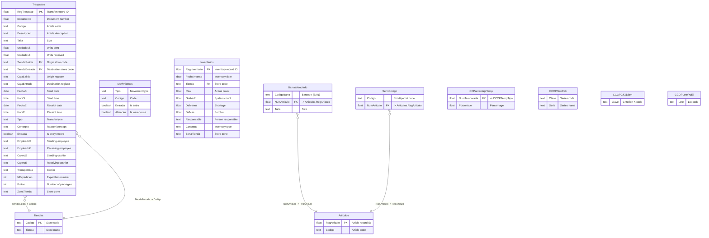

# Stock & Logistics Domain

> Stock transfers, inventory management, logistics, barcodes, and RFID.

## Entity Relationship Diagram

## Table Descriptions

| Table | Rows | Columns | Description |
|-------|------|---------|-------------|
| **Traspasos** | 262,689 | 30 | Stock transfers between stores and regularizations. Contains origin/destination, article, size, quantities, timestamps, and reason codes (e.g., "Traspaso", "Regularizacion", "S-Robo" for theft). |
| **Movimientos** | 4 | 4 | Stock movement type definitions. Minimal reference table. |
| **BarrasAsociado** | 63,756 | -- | Associated barcodes. Maps additional EAN codes to articles (beyond the primary CodigoBarra on Articulos). |
| **SemiCodigo** | 110,536 | -- | Short/partial codes. Lookup for partial barcode scanning or internal short codes. |
| **CCPorcentajeTemp** | 406 | -- | Season percentage allocations. |
| **CCOPSeriCali** | 47 | -- | Size series/caliber definitions (e.g., S/M/L, 36-46, etc.). |
| **CCOPCriXDiam** | 3 | -- | Criterion X (diamond/special) definitions. |
| **CCOPLotePuEj** | 3 | -- | Lot/batch definitions. |

## Empty / Unused Tables

| Table | Description |
|-------|-------------|
| Inventarios | Physical inventory counts (0 rows -- likely archived/seasonal) |
| Logistica | Logistics management module (78 columns, empty) |
| PackingList | Packing list documents (12 columns, empty) |
| Reposiciones | Replenishment orders (6 columns, empty) |
| AutoReposicion | Automatic replenishment rules |
| BalanceoStock | Stock balancing/leveling |
| ReposicionAnulada | Cancelled replenishments |
| ReserTraspa | Transfer reservations |
| TraspasosFallidos | Failed transfers |
| DetalleInventa | Inventory count details |
| LOGNivel1 | Logistics level 1 zones |
| LOGNivel2 | Logistics level 2 zones |
| LOGNivel3 | Logistics level 3 zones |
| LOGZonas | Logistics zones |
| RFIDMovimientos | RFID tag movements |
| RFIDNumerosSerie | RFID serial numbers |
| RFIDSinMovimiento | RFID tags without movement |
| InformeReposicion | Replenishment reports (1 row) |
| LineasInformeReposicion | Replenishment report lines (9 rows) |
| CCSMSTMinimos | Minimum stock SMS alerts |
| Nextail | Nextail integration data |
| IncidenciasRecepcion | Reception incidents |

## Notes

- **Traspasos** is the primary stock movement table (263K rows), used for both inter-store transfers and stock regularizations (adjustments for theft, damage, etc.).
- Each transfer appears twice: once as an exit from origin store (Entrada=false) and once as an entry at destination (Entrada=true), matched by `Documento` number.
- **BarrasAsociado** (64K rows) supplements `Articulos.CodigoBarra` by mapping multiple EAN barcodes to a single article (e.g., different size barcodes).
- **SemiCodigo** (111K rows) is a large lookup for partial code resolution during scanning.
- The **RFID** module (RFIDMovimientos, RFIDNumerosSerie, RFIDSinMovimiento) exists in the schema but is completely empty.
- The **Logistics** module (Logistica, PackingList, LOGNivel1-3, LOGZonas) is defined but unused.
- **Inventarios** (physical counts) is empty -- inventory data may be archived after reconciliation or performed via external systems.
- Stock positions are primarily tracked in the **CCStock** table (Products domain), which uses a wide-format layout with stock quantities per size per store.

## Stock via Exportaciones (preferred for ETL)

The `Exportaciones` table (2,058,201 rows) is the preferred source for per-store, per-size stock in ETL and analytics. It was the export table used by the legacy VFP application and is actively maintained.

**Structure:** One row per (article, store) pair. Columns `Talla1..Talla34` hold size labels; `Stock1..Stock34` hold corresponding quantities. Additional columns: `CCStock` (warehouse stock), `STStock` (total computed stock), `Tienda` (store name), `TiendaCodigo` (composite key), `FechaModifica`, `HoraModifica`.

**Key gotcha — TiendaCodigo format:** The `TiendaCodigo` field is `"tienda/articulo"` (e.g. `"104/169"`), NOT just a store code. The compound `(Codigo, TiendaCodigo)` is the natural PK.

**ETL normalization:** The wide format must be unpivoted to `(codigo, tienda_codigo, talla, stock)` rows for PostgreSQL. See [etl-sync-strategy.md](../etl-sync-strategy.md).

## ETL Sync Strategy

> Validated against production data 2026-03-30.

| Table | Rows | Delta field | Strategy |
|-------|------|-------------|---------|
| Exportaciones | 2,058,201 | `FechaModifica` (NULLs exist for zero-stock articles) | UPSERT delta + unpivot |
| Traspasos | 262,689 | `FechaS` (send date — no FechaModifica) | Append-only by `FechaS` |

**Traspasos** is mostly historical: only 153 new rows since 2025-01-01. Records appear immutable once created. Append-only by `FechaS` is safe.

See [etl-sync-strategy.md](../etl-sync-strategy.md) for the full sync plan.
