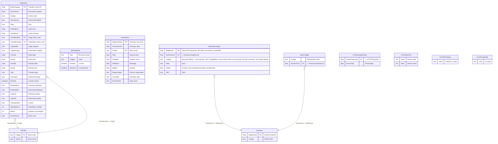

# Stock & Logistics Domain

> Stock transfers, inventory management, logistics, barcodes, and RFID.

## Entity Relationship Diagram


```mermaid
erDiagram
    Traspasos {
        float RegTraspaso PK "Transfer record ID"
        float Documento "Document number"
        text Codigo "Article code"
        text Descripcion "Article description"
        text Talla "Size"
        float UnidadesS "Units sent"
        float UnidadesE "Units received"
        text TiendaSalida FK "Origin store code"
        text TiendaEntrada FK "Destination store code"
        text CajaSalida "Origin register"
        text CajaEntrada "Destination register"
        date FechaS "Send date"
        time HoraS "Send time"
        date FechaE "Receipt date"
        time HoraE "Receipt time"
        text Tipo "Transfer type"
        text Concepto "Reason/concept"
        boolean Entrada "Is entry record"
        text EmpleadoS "Sending employee"
        text EmpleadoE "Receiving employee"
        text CajeroS "Sending cashier"
        text CajeroE "Receiving cashier"
        text Transportista "Carrier"
        int NExpedicion "Expedition number"
        int Bultos "Number of packages"
        text ZonaTienda "Store zone"
    }

    Movimientos {
        text Tipo "Movement type"
        text Codigo "Code"
        boolean Entrada "Is entry"
        boolean Almacen "Is warehouse"
    }

    Inventarios {
        float RegInventario PK "Inventory record ID"
        date FechaInventa "Inventory date"
        text Tienda FK "Store code"
        float Real "Actual count"
        float Grabado "System count"
        float DeMenos "Shortage"
        float DeMas "Surplus"
        text Responsable "Person responsible"
        text Concepto "Inventory type"
        text ZonaTienda "Store zone"
    }

    BarrasAsociado {
        float RegBarras PK "Record ID (assumed .99-suffix convention, unverified)"
        float NumArticulo FK "-> Articulos.RegArticulo"
        text Codigo "Barcode (EAN) — size-specific. NOT CodigoBarra: that column does not exist here (D-048 correction, see Notes below)"
        text Talla "Size"
        float NTalla "Numeric size-ordering hint (type unconfirmed)"
        text SKU "SKU"
    }

    SemiCodigo {
        text Codigo "Short/partial code"
        float NumArticulo FK "-> Articulos.RegArticulo"
    }

    CCPorcentajeTemp {
        float NumTemporada FK "-> CCOPTempTipo"
        float Porcentaje "Percentage"
    }

    CCOPSeriCali {
        text Clave "Series code"
        text Serie "Series name"
    }

    CCOPCriXDiam {
        text Clave "Criterion X code"
    }

    CCOPLotePuEj {
        text Lote "Lot code"
    }

    Traspasos }o--|| Tiendas : "TiendaSalida -> Codigo"
    Traspasos }o--|| Tiendas : "TiendaEntrada -> Codigo"
    BarrasAsociado }o--|| Articulos : "NumArticulo -> RegArticulo"
    SemiCodigo }o--|| Articulos : "NumArticulo -> RegArticulo"

    Tiendas {
        text Codigo PK "Store code"
        text Tienda "Store name"
    }

    Articulos {
        float RegArticulo PK "Article record ID"
        text Codigo "Article code"
    }
```

## Table Descriptions

| Table | Rows | Columns | Description |
|-------|------|---------|-------------|
| **Traspasos** | 262,689 | 30 | Stock transfers between stores and regularizations. Contains origin/destination, article, size, quantities, timestamps, and reason codes (e.g., "Traspaso", "Regularizacion", "S-Robo" for theft). |
| **Movimientos** | 4 | 4 | Stock movement type definitions. Minimal reference table. |
| **BarrasAsociado** | 63,756 | 10 | Associated barcodes. Maps additional EAN codes to articles (beyond the primary CodigoBarra on Articulos) — one row per (article, size) variant in practice. Mirrored as `ps_barras_asociado`; the only place in the schema carrying a general-purpose size label reachable from a sale line (see D-048, sales-by-size). |
| **SemiCodigo** | 110,536 | -- | Short/partial codes. Lookup for partial barcode scanning or internal short codes. |
| **CCPorcentajeTemp** | 406 | -- | Season percentage allocations. |
| **CCOPSeriCali** | 47 | -- | Size series/caliber definitions (e.g., S/M/L, 36-46, etc.). |
| **CCOPCriXDiam** | 3 | -- | Criterion X (diamond/special) definitions. |
| **CCOPLotePuEj** | 3 | -- | Lot/batch definitions. |

## Empty / Unused Tables

| Table | Description |
|-------|-------------|
| Inventarios | Physical inventory counts (0 rows -- likely archived/seasonal) |
| Logistica | Logistics management module (78 columns, empty) |
| PackingList | Packing list documents (12 columns, empty) |
| Reposiciones | Replenishment orders (6 columns, empty) |
| AutoReposicion | Automatic replenishment rules |
| BalanceoStock | Stock balancing/leveling |
| ReposicionAnulada | Cancelled replenishments |
| ReserTraspa | Transfer reservations |
| TraspasosFallidos | Failed transfers |
| DetalleInventa | Inventory count details |
| LOGNivel1 | Logistics level 1 zones |
| LOGNivel2 | Logistics level 2 zones |
| LOGNivel3 | Logistics level 3 zones |
| LOGZonas | Logistics zones |
| RFIDMovimientos | RFID tag movements |
| RFIDNumerosSerie | RFID serial numbers |
| RFIDSinMovimiento | RFID tags without movement |
| InformeReposicion | Replenishment reports (1 row) |
| LineasInformeReposicion | Replenishment report lines (9 rows) |
| CCSMSTMinimos | Minimum stock SMS alerts |
| Nextail | Nextail integration data |
| IncidenciasRecepcion | Reception incidents |

## Notes

- **Traspasos** is the primary stock movement table (263K rows), used for both inter-store transfers and stock regularizations (adjustments for theft, damage, etc.).
- Each transfer appears twice: once as an exit from origin store (Entrada=false) and once as an entry at destination (Entrada=true), matched by `Documento` number.
- **BarrasAsociado** (64K rows) supplements `Articulos.CodigoBarra` by mapping multiple EAN barcodes to a single article (e.g., different size barcodes). The barcode column is `Codigo` (Alpha 60) — **not** `CodigoBarra`, which this file previously (and incorrectly) claimed existed on this table; that name belongs to `Articulos.CodigoBarra` (the article's single default barcode), a different column on a different table. Corrected 2026-08-29, D-048.
- **Sales-by-size (D-048)**: `LineasVentas` (retail sales lines, see [sales.md](sales.md)) has no general size column of its own — `ps_lineas_ventas_talla` (a PostgreSQL view, `etl/schema/init.sql`) resolves one per sale line by joining `ps_lineas_ventas.codigo_asociado` to `ps_barras_asociado.codigo`. That join key is a **hypothesis** (the column-name pairing between `LineasVentas.CodigoAsociado` and this table), not independently confirmed against the live 4D server — run `ps sql verify-talla-join` to check coverage before trusting a low or surprising number. The view collapses `ps_barras_asociado` to one row per barcode BEFORE joining, because that table's PK is `reg_barras` and nothing makes `codigo` unique — joining it raw multiplied a sale line by the number of matching barcode rows (measured on a 4-line fixture: 7 rows instead of 4, 29 units instead of 17, and invented sales of sizes that never sold). A barcode pointing at several distinct sizes resolves to NULL with `talla_resolucion = 'ambiguo'`, never to an arbitrary pick. Full rationale: [docs/decisions/D-048-sales-by-size.md](../decisions/D-048-sales-by-size.md).
- **SemiCodigo** (111K rows) is a large lookup for partial code resolution during scanning.
- The **RFID** module (RFIDMovimientos, RFIDNumerosSerie, RFIDSinMovimiento) exists in the schema but is completely empty.
- The **Logistics** module (Logistica, PackingList, LOGNivel1-3, LOGZonas) is defined but unused.
- **Inventarios** (physical counts) is empty -- inventory data may be archived after reconciliation or performed via external systems.
- Stock positions are primarily tracked in the **CCStock** table (Products domain), which uses a wide-format layout with stock quantities per size per store.

## Stock via Exportaciones (preferred for ETL)

The `Exportaciones` table (2,058,201 rows) is the preferred source for per-store, per-size stock in ETL and analytics. It was the export table used by the legacy VFP application and is actively maintained.

**Structure (confirmed from `Exportaciones_SQL` view, 2026-04-05):** One row per (article, store) pair with a **34-slot size matrix**:
- `Talla1..Talla34` — size label per slot (e.g. "XS", "S", "M", "L", "XL", "40", "42"...)
- `Stock1..Stock34` — current stock quantity per size (**`_USER_COLUMNS`:** `DATA_TYPE = 3`, `DATA_LENGTH = 2` — **16-bit integer** in the 4D structure). Via **4D SQL / p4d**, negatives are often returned as **unsigned** (`65535` = `−1`); the ETL reinterprets before `ps_stock_tienda.stock`. Compare with the POS grid: per-size cells show signed values natively.
- `Minimo1..Minimo34` — minimum stock quantity per size
- `REPPorcentaje1..REPPorcentaje34` — replenishment percentage per size
- `STStock` — **Real** (`DATA_TYPE = 6`) — secondary numeric field on the export row (legacy naming; not a substitute for slot-level analysis).
- `CCStock` — **Real** (`DATA_TYPE = 6`) — **row-level net stock** for that `(Codigo, TiendaCodigo)` (matches the “TS” style total in POS when slots are signed). This is **not** the wide **`CCStock` table** in the Products domain (582 columns); same name, different object.
- `Tienda` (store name), `TiendaCodigo` (composite key), `Codigo` (article code)
- `FechaModifica`, `HoraModifica` — delta sync fields
- `Ubicacion1`, `Ubicacion2`, `Ubicacion3` — warehouse location codes
- `PuntoPedido`, `Recomendado`, `UnidadesReposi` — replenishment config
- `REPPrioridadWeb` — web replenishment priority
- `BORRAR5`, `BORRAR6`, `BORRAR7`, `BORRAR8`, `BORRAR9`, `BORRAR10`, `BORRAR12` — **deprecated columns, always ignore**

> **Note on slot count:** Not all 34 slots are populated for every article. The number of active
> slots is determined by the article's product family (`FamiGrupMarc.SerieTallas` field).
> Clothing typically uses slots 1-17 (S/M/L/XL...), footwear and optics use all 34.
> Empty slots have `Talla=''` and `Stock=0`.

**Key gotcha — TiendaCodigo format:** The `TiendaCodigo` field is `"tienda/articulo"` (e.g. `"104/169"`), NOT just a store code. The compound `(Codigo, TiendaCodigo)` is the natural PK.

**ETL normalization:** The wide format must be unpivoted to `(codigo, tienda_codigo, talla, stock)` rows for PostgreSQL. Filter out empty talla slots (`WHERE talla != ''`). Each `StockN` is decoded with `decode_signed_int16_word()` so SQL-layer unsigned values become signed integers. See [etl-sync-strategy.md](../etl-sync-strategy.md).

## Size Series System (FamiGrupMarc.SerieTallas)

The 34-slot matrix in Exportaciones, GCLinPedidos, GCLinAlbarane is not random — each product family
uses a specific **size series** that maps slot numbers to labels.

The `SerieTallas` field in `FamiGrupMarc` (product family table) defines which series a family uses.
The actual series definitions are in `CCOPSeriCali` (47 rows — e.g., "S/M/L", "36-46", etc.).

**This is the key to interpreting size slot data:**
- A slot `Talla1="XS"` in one article family might be slot `Talla1="36"` in another
- For analytics, always JOIN through `FamiGrupMarc.SerieTallas` → `CCOPSeriCali` to know what each slot means
- Or simply use the literal `Talla1..Talla34` labels stored in each Exportaciones row (they are pre-populated from the series)

> **Action item:** Call `WS_JS_GetTablaIDs` SOAP method (needs `Entrada1` parameter — try `""`) to get
> the complete talla series lookup table, which maps series codes to size slot labels.

## ETL Sync Strategy

> Validated against production data 2026-03-30; CCStock added 2026-05-01.

| Table | Rows | Delta field | Strategy |
|-------|------|-------------|---------|
| Exportaciones | 2,058,201 | `FechaModifica` (NULLs exist for zero-stock articles) | UPSERT delta + unpivot |
| Traspasos | 262,689 | `FechaS` (send date — no FechaModifica) | Append-only by `FechaS` |
| CCStock | 41,478 | None | Full refresh nightly → `ps_stock_central` |
| BarrasAsociado | 63,756 | `FModifica` (exists but not used as a delta — see below) | Full refresh nightly → `ps_barras_asociado` (D-048) |

**BarrasAsociado** (D-048, sales-by-size): although `FModifica` exists on the live column list, the ETL uses a plain full refresh — same call as `ps_tiendas`/`ps_proveedores`/`ps_gc_comerciales` at this row count (~64K), where the complexity of watermark tracking doesn't pay for itself. Revisit if the table grows substantially. See `etl/sync/barras_asociado.py` and [docs/decisions/D-048-sales-by-size.md](../decisions/D-048-sales-by-size.md).

**Traspasos** is mostly historical: only 153 new rows since 2025-01-01. Records appear immutable once created. Append-only by `FechaS` is safe.

### CCStock (central warehouse stock) — confirmed 2026-05-01

`CCStock` is the central-warehouse stock matrix: one row per article (41 478 rows), 34 stock-slot columns (`Stock1..Stock34`). Confirmed field types via `_USER_COLUMNS`:

- `NumArticulo` : `DATA_TYPE=6` (Real, 8 bytes) — PK (.99 suffix pattern)
- `Stock` : `DATA_TYPE=6` (Real, 8 bytes) — row-level total maintained by 4D
- `Stock1..Stock34` : **`DATA_TYPE=3, DATA_LENGTH=2` (16-bit WORD)** — same type as `Exportaciones.StockN`. The p4d driver returns unsigned values for negatives (`65535 = −1`). `decode_signed_int16_word()` is applied on each slot before summing.
- `FechaModifica` : `DATA_TYPE=8` (Date)

> **Important correction to issue #428 description**: The issue stated CCStock columns are "Real (DATA_TYPE=6)". This is TRUE for the root-level `Stock` column but FALSE for `Stock1..Stock34` which are int16 WORD (type 3, length 2) — confirmed by `_USER_COLUMNS` and live samples showing 65535 values. The ETL must apply `decode_signed_int16_word()` on these slots, the same as for `Exportaciones`.

**Mirror**: `ps_stock_central` columns: `num_articulo NUMERIC(20,3) PK`, `stock INTEGER` (SUM of 34 decoded slots), `fecha_modifica DATE`. Full-refresh nightly; ~41 500 rows; no watermark needed.

See [etl-sync-strategy.md](../etl-sync-strategy.md) for the full sync plan.

---

## LLM:tables

```json
[
  {
    "table": "ps_stock_tienda",
    "alias": "StockTienda",
    "description": "Stock por tienda y talla. tienda=99 es almacén central.",
    "keyColumns": ["codigo (FK)", "tienda", "talla", "stock", "fecha_modifica"]
  },
  {
    "table": "ps_traspasos",
    "alias": "Traspaso",
    "description": "Traspasos de stock. Cada movimiento = 2 filas (salida + entrada).",
    "keyColumns": ["codigo (FK)", "tienda_salida", "tienda_entrada", "entrada", "unidades_s", "unidades_e", "fecha_s", "talla"]
  },
  {
    "table": "ps_barras_asociado",
    "alias": "BarraAsociada",
    "description": "Códigos de barras (EAN) adicionales por artículo — en la práctica, una fila por (artículo, talla). Única tabla con talla de propósito general alcanzable desde una línea de venta (D-048).",
    "keyColumns": ["reg_barras (PK)", "num_articulo (FK -> ps_articulos.reg_articulo)", "codigo (EAN, talla-específico)", "talla", "n_talla"]
  },
  {
    "table": "ps_lineas_ventas_talla",
    "alias": "LineaVentaTalla",
    "description": "VISTA (no tabla física). Resuelve la talla de cada línea de venta uniendo ps_lineas_ventas.codigo_asociado con ps_barras_asociado.codigo (D-048) — clave de unión NO verificada en vivo, ver talla_resolucion para saber qué líneas resolvieron talla ('ok'/'sin_codigo_asociado'/'sin_match'/'ambiguo'). Emite EXACTAMENTE una fila por línea de venta: SUM(unidades) sobre la vista siempre cuadra con la tabla base.",
    "keyColumns": ["reg_lineas", "codigo", "codigo_asociado", "talla", "unidades", "talla_resolucion"]
  }
]
```

## LLM:relationships

```json
[
  {"from": "ps_stock_tienda",  "fromColumn": "codigo",         "to": "ps_articulos", "toColumn": "codigo", "type": "MANY_TO_ONE"},
  {"from": "ps_stock_tienda",  "fromColumn": "tienda",         "to": "ps_tiendas",   "toColumn": "codigo", "type": "MANY_TO_ONE"},
  {"from": "ps_traspasos",     "fromColumn": "tienda_salida",  "to": "ps_tiendas",   "toColumn": "codigo", "type": "MANY_TO_ONE"},
  {"from": "ps_traspasos",     "fromColumn": "tienda_entrada", "to": "ps_tiendas",   "toColumn": "codigo", "type": "MANY_TO_ONE"},
  {"from": "ps_traspasos",     "fromColumn": "codigo",         "to": "ps_articulos", "toColumn": "codigo", "type": "MANY_TO_ONE"},
  {"from": "ps_barras_asociado", "fromColumn": "num_articulo", "to": "ps_articulos", "toColumn": "reg_articulo", "type": "MANY_TO_ONE"},
  {"from": "ps_lineas_ventas", "fromColumn": "codigo_asociado", "to": "ps_barras_asociado", "toColumn": "codigo", "type": "MANY_TO_ONE"}
]
```
