# Stores, HR & Finance Domain

> Store configuration, employee management, payment methods, vouchers, and supporting tables.

## Entity Relationship Diagram

```mermaid
erDiagram
    Tiendas {
        float RegTienda PK "Store record ID"
        text Codigo "Store code (e.g., 153)"
        text CodigoC "Central code"
        text Direccion "Address"
        text Poblacion "City"
        text Provincia "Province"
        text Postal "Postal code"
        text Telefono "Phone"
        text Cajero "Default cashier"
        float UltimaActualizacion "Last sync timestamp"
    }

    RRHHEmpleados {
        float RegEmpleado PK "Employee record ID"
        text CodigoEmpleado "Employee code"
        text Nombre "First name"
        text Apellidos "Last name"
        text DNI "National ID"
        text Tienda "Assigned store"
        text PuestoTrabajo "Job position"
        text Departamento "Department"
        text Categoria "Category"
        float Comision "Commission rate"
        boolean Operativo "Is active"
        date FechaAlta "Hire date"
        date FechaBaja "Termination date"
        text TipoContrato "Contract type"
        int HorasSemanales "Weekly hours"
        boolean PDFuturShop "FuturShop access"
        boolean PDAdministrador "Admin access"
    }

    FormasPago {
        text FormaPago "Payment method name"
        text Forma "Short form code"
        boolean Activo "Is active"
        boolean Compra "Used for purchases"
        boolean Venta "Used for sales"
        boolean Remesable "Can be remitted"
        int DiaA "Payment day A"
        int DiaC "Payment day C"
        int GCDPP "Early payment days"
    }

    CobrosFacturas {
        float RegCobroRefAde PK "Collection record ID"
        float NumFactura FK "-> GCFacturas.RegFactura"
        float NumCliente FK "-> Clientes.RegCliente"
        text Cliente "Customer name"
        float Importe "Amount"
        date Fecha "Collection date"
        boolean Pagado "Is paid"
        text Forma "Payment method"
        int Mes "YYYYMM period"
        text Tienda "Store"
        boolean Abono "Is credit"
        float NumComercial FK "-> GCComerciales"
        boolean DRDevuelto "Is returned/bounced"
        text DRMotivoDevol "Return reason"
    }

    Vales {
        float Numero PK "Voucher number"
        date Entrega "Issue date"
        date Recepcion "Redemption date"
        text CliEntrega "Issuing customer"
        text CliRecepcion "Redeeming customer"
        float Importe "Voucher value"
        text TiendaEnt "Issuing store"
        text TiendaRec "Redeeming store"
        boolean VentaBorrada "Sale voided"
        boolean AnuladoCentral "Voided by HQ"
    }

    TarjetasRegalo {
        text NTarjeta PK "Gift card number"
        text Tienda "Store"
        date Fecha "Issue date"
        text Responsable "Issuing person"
        float Importe "Card value"
        float Consumido "Amount spent"
        float Disponible "Remaining balance"
        boolean Anulada "Is cancelled"
    }

    Monedas {
        text Moneda "Currency name"
    }

    MonedasBilletes {
        text Denominacion "Bill/coin denomination"
    }

    TablaImpuestos {
        float Porcentaje "Tax percentage"
        text Descripcion "Tax description"
    }

    Paises {
        text Pais "Country name"
        text ISO "ISO code"
    }

    Provincias {
        text Provincia "Province name"
        text Codigo "Province code"
    }

    Listas {
        text Codigo "List code"
        text Descripcion "List description"
    }

    Contadores {
        text Tipo "Counter type"
        float Valor "Current value"
    }

    RRHHAcceso {
        float RegEmpleado FK "-> RRHHEmpleados"
        date Fecha "Access date"
        time Hora "Access time"
    }

    Tiendas ||--o{ RRHHEmpleados : "store assignment"
    Tiendas ||--o{ Vales : "TiendaEnt"
    Tiendas ||--o{ TarjetasRegalo : "Tienda"
    CobrosFacturas }o--|| GCFacturas : "NumFactura"
    RRHHEmpleados ||--o{ RRHHAcceso : "RegEmpleado"
```

## Table Descriptions

| Table | Rows | Columns | Description |
|-------|------|---------|-------------|
| **Tiendas** | 51 | 209 | Store master. Address, phone, responsible person, cash register count, franchise code, and extensive configuration (209 columns). |
| **RRHHEmpleados** | 15 | 104 | Employee master. Personal data, contract, position, permissions for each PowerShop module, and commission rates. |
| **FormasPago** | 24 | 30 | Payment method definitions (cash, card types, transfers, etc.). Lookup for POS and wholesale. |
| **CobrosFacturas** | 12,459 | 30 | Invoice payment collections. Tracks payments received against wholesale invoices, including bounced payments. |
| **Vales** | 54,414 | 11 | Vouchers/credit notes. Store credit issued and redeemed across stores. |
| **TarjetasRegalo** | 9 | 9 | Gift cards with balance tracking (loaded, spent, available). |
| **Monedas** | 3 | -- | Currency definitions (e.g., EUR, USD). |
| **MonedasBilletes** | 15 | -- | Bill/coin denominations for cash counting. |
| **TablaImpuestos** | 15 | -- | Tax rate table. |
| **Paises** | 11 | 10 | Country reference data. |
| **Provincias** | 70 | 3 | Province/region reference data. |
| **Listas** | 40 | 5 | Generic lookup lists (wish lists, reservations). |
| **Contadores** | 31 | -- | Auto-increment counters for document numbering. |
| **RRHHAcceso** | 937 | -- | Employee system access log. |

## Supporting Tables

| Table | Rows | Description |
|-------|------|-------------|
| Informes | 51,706 | Report definitions and cached results |
| Exportaciones | 2,055,751 | Export/sync log (largest table by rows) |
| Control | 3,256 | System control records |
| Controles | 1,284 | Additional control/audit records |
| Comunica | 2,716 | Inter-store communication messages |
| PNMensajes | 108 | Push notification messages |
| PSCComentarios | 39,924 | Product/service comments (PSCommerce) |
| Bloqueos | 172 | Record lock tracking |
| SaftAnulados | 1,071 | SAFT voided document records |
| DetalleSaftAnula | 45,542 | SAFT void details |
| CambiosSeries | 9 | Document series changes |
| IvaXPais | 2 | VAT rates by country |
| Acceso | 1 | System access configuration |
| AUXIndexList | 1,783 | Index management auxiliary table |

## Empty / Unused Tables -- HR Module

| Table | Description |
|-------|-------------|
| RRHHAusencias | Employee absences |
| RRHHBajas | Employee terminations |
| RRHHBeneficios | Employee benefits |
| RRHHComisiones | Commission calculations |
| RRHHComportamiento | Behavior/performance records |
| RRHHConocimientos | Skills/knowledge |
| RRHHContratos | Contract documents |
| RRHHControlPresencia | Attendance tracking |
| RRHHExperiencia | Work experience |
| RRHHFamiliares | Family members |
| RRHHHistorial | Employment history |
| RRHHHorasExtras | Overtime tracking |
| RRHHHuellas | Fingerprint data |
| RRHHSalarios | Salary records |
| RRHHTitulaciones | Qualifications |
| RRHHTurnos | Work shift definitions |
| RRHHVacaciones | Vacation tracking |

## Empty / Unused Tables -- Finance & Config

| Table | Description |
|-------|-------------|
| CuentasBancarias | Bank account definitions |
| Bancos | Bank master data |
| Tarifas | Price list definitions |
| TarjetasTienda | Store-specific card config |
| Cierres | Period closings |
| Presupuestos | Budgets |
| Comisiones | Commission calculations |
| MotivosDescuento | Discount reason codes |
| MotivosDevolucion | Return reason codes |
| MotivosAusencia | Absence reason codes |
| MotivosBajas | Termination reason codes |
| PuestosTienda | Store position definitions |
| Postales | Postal code lookups |

## Notes

- **Tiendas** has 209 columns covering store identity, multi-register config, franchise data, fiscal settings, web/commerce flags, and operational parameters.
- **Exportaciones** (2M+ rows) is the largest table by row count -- it logs all data synchronization events between stores and the central server.
- **RRHHEmpleados** includes per-module access flags (PDFuturShop, PDWarehouse, PDFinancials, PDCommerce, PDAdministrador, etc.) acting as a permission system.
- The full HR module (RRHH*) has 17+ tables but only RRHHEmpleados (15 rows) and RRHHAcceso (937 rows) contain data. The rest of the HR functionality is unused.
- **Vales** (54K rows) tracks vouchers/store credit across stores, with both issuance and redemption tracked by store.
- **FormasPago** is a shared lookup used by POS, wholesale, and purchasing modules.
