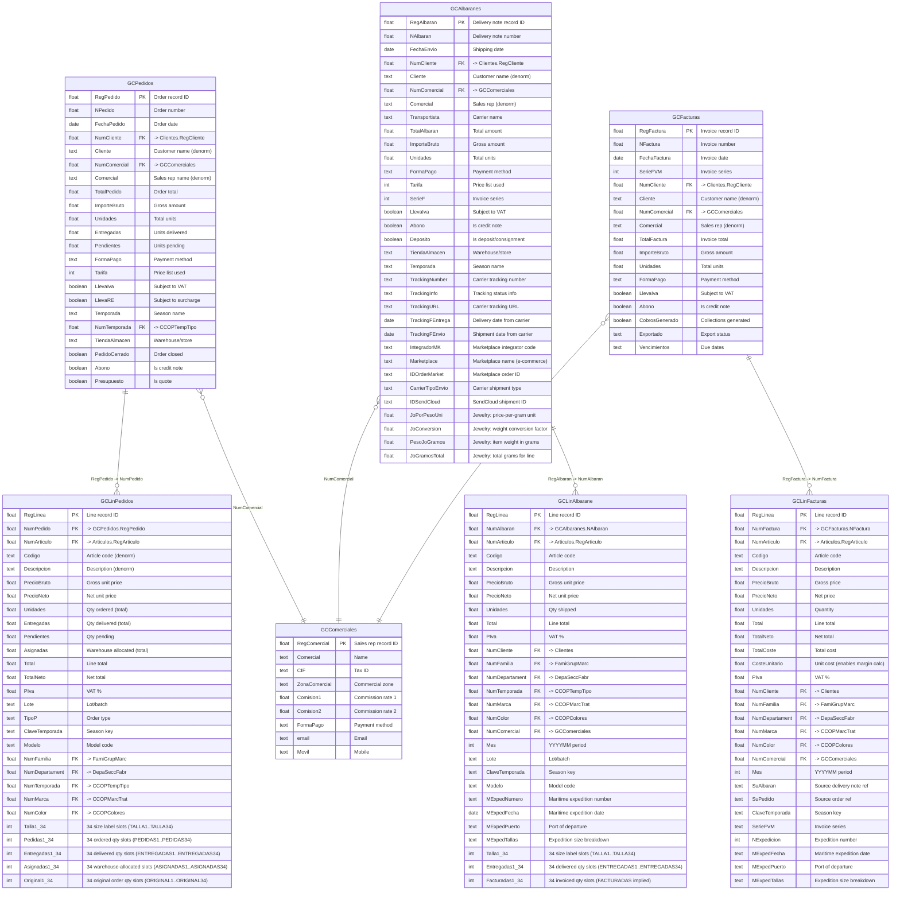
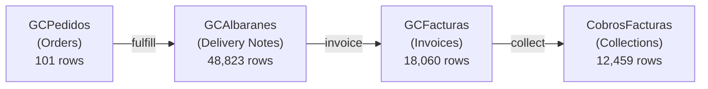

# Wholesale / Gestion Comercial Domain

> Wholesale orders, delivery notes, invoices, and sales representatives.

## Entity Relationship Diagram



## Wholesale Document Flow



## Table Descriptions

| Table | Rows | Columns | Description |
|-------|------|---------|-------------|
| **GCPedidos** | 101 | 124 | Wholesale purchase orders from B2B customers. Contains order totals, VAT breakdown, payment terms, season, and delivery dates. |
| **GCLinPedidos** | 2,645 | 239 | Order line items. One row per article per order. Widest wholesale table: 34-slot size matrix with 5 quantity dimensions per slot (ordered, delivered, allocated, original, size label). Discovered 2026-04-05. |
| **GCAlbaranes** | 48,823 | 163 | Wholesale delivery notes (albaranes). Documents for goods shipped to wholesale customers. Includes carrier tracking fields (TrackingNumber/URL/dates), marketplace integration (Marketplace, IDOrderMarket), and jewelry weight-pricing fields. Discovered 2026-04-05. |
| **GCLinAlbarane** | 1,013,799 | 138 | Delivery note line items. The largest wholesale table — one row per article per shipment. Has 34-slot size matrix (TALLA/ENTREGADAS per slot) and maritime expedition fields. Discovered 2026-04-05. |
| **GCFacturas** | 18,060 | 185 | Wholesale invoices with full fiscal data, payment terms, and collection status. |
| **GCLinFacturas** | 974,742 | 63 | Invoice line items. Has COSTEUNITARIO and TOTALCOSTE — enables exact margin calculation per line. Source document traceability via SUALBARAN and SUPEDIDO. Discovered 2026-04-05. |
| **GCComerciales** | 5 | 50 | Sales representatives/commercial agents. Commission structures and contact info. |

## Supporting Tables

| Table | Rows | Description |
|-------|------|-------------|
| GCContactos | 5 | Additional contacts for wholesale clients |
| GCTransporte | 9 | Transport/carrier definitions |
| GCGestionIncidencias | 37 | Incident management for wholesale |
| GCIncidencias | 5 | Incident type records |
| GCTiposIncidencias | 1 | Incident type definitions |
| DivisionPedido | 1,922 | Order split/allocation records |
| DivisionAlbaran | 2,511 | Delivery note split records |

## Empty / Unused Tables

| Table | Description |
|-------|-------------|
| GCPedidoTipo | Order type definitions |
| GCAsignaciones | Stock assignments to orders |
| GCCondicionesFactura | Special invoice conditions |
| GCSistemaComisiones | Commission system rules |
| GCZonasCom | Commercial zone definitions |

## Notes

- The wholesale flow follows a standard document chain: **Order -> Delivery Note -> Invoice -> Collection**.
- **GCLinAlbarane** (1M+ rows) is the primary source for wholesale sales analytics, carrying full product classification (family, department, season, brand, color) denormalized for reporting.
- **GCLinFacturas** closely mirrors GCLinAlbarane but at the invoice level. Both carry `Mes` (YYYYMM) for period filtering.
- All header tables (GCPedidos, GCAlbaranes, GCFacturas) link to `Clientes` via `NumCliente` and to `GCComerciales` via `NumComercial`.
- **GCLinPedidos** is the widest wholesale table (239 columns) due to the 5-dimension × 34-slot size matrix.
- **Wholesale also handles e-commerce**: GCAlbaranes has Marketplace, IDOrderMarket, and IntegradorMK fields — same pattern as retail Ventas. Discovered 2026-04-05.
- **Jewelry weight-based pricing**: GCAlbaranes has JoPorPesoUni, JoConversion, PesoJoGramos, JoGramosTotal — indicates the business sells jewelry priced by weight in the wholesale channel. Discovered 2026-04-05.

## Wholesale Size Matrix

> Discovered 2026-04-05

Wholesale line tables use a **34-slot size matrix** where each slot represents one size in a garment's size run. The slot index (1–34) maps to a size label stored in the corresponding TALLA slot.

### GCLinPedidos — 5 quantity dimensions per slot

| Column group | Description |
|---|---|
| `TALLA1..TALLA34` | Size label for slot N (e.g. "XS", "S", "M", "L", "XL") |
| `PEDIDAS1..PEDIDAS34` | Quantity ordered per size slot |
| `ENTREGADAS1..ENTREGADAS34` | Quantity delivered per size slot |
| `ASIGNADAS1..ASIGNADAS34` | Quantity warehouse-allocated per size slot (reserved, not yet shipped) |
| `ORIGINAL1..ORIGINAL34` | Original quantity at order creation (before modifications) |

Summary fields: `UNIDADES` (total ordered), `ENTREGADAS` (total delivered), `PENDIENTES` (total pending), `ASIGNADAS` (total allocated).

### GCLinAlbarane — 2 quantity dimensions per slot

| Column group | Description |
|---|---|
| `TALLA1..TALLA34` | Size label for slot N |
| `ENTREGADAS1..ENTREGADAS34` | Quantity shipped per size slot |

### Query pattern

To aggregate size-level quantities, unpivot the 34 slots in PostgreSQL:
```sql
-- Example: total units per size across all delivery note lines
SELECT size_slot, SUM(qty_delivered) AS units
FROM ps_gc_lin_albarane
CROSS JOIN LATERAL (VALUES
  (talla1, entregadas1), (talla2, entregadas2), ... (talla34, entregadas34)
) AS t(size_slot, qty_delivered)
WHERE size_slot IS NOT NULL AND qty_delivered > 0
GROUP BY size_slot
ORDER BY units DESC;
```
This is expensive on 1M rows — add a `WHERE numalbaran IN (...)` filter when possible.

## Maritime Expedition Fields

> Discovered 2026-04-05

Fields `MEXPEDNUMERO`, `MEXPEDFECHA`, `MEXPEDPUERTO`, `MEXPEDTALLAS` appear in both **GCLinAlbarane** and **GCLinPedidos** (and `MEXPEDFECHA`/`MEXPEDPUERTO`/`MEXPEDTALLAS` in GCLinFacturas). They indicate international wholesale shipments sent by sea:

| Field | Description |
|---|---|
| `MEXPEDNUMERO` | Maritime expedition reference number |
| `MEXPEDFECHA` | Date of departure |
| `MEXPEDPUERTO` | Port of departure |
| `MEXPEDTALLAS` | Size breakdown for the maritime shipment (text, not matrix) |

These fields are NULL for domestic land deliveries and populated only for international sea freight orders.

## SQL Views

> Discovered 2026-04-05

The following wholesale tables are queryable via the 4D SQL port (19812) using `_SQL`-suffixed view names. These views expose the full column set including the 34-slot size matrix:

| SQL View name | Underlying table | Key addition |
|---|---|---|
| `GCPedidos_SQL` | GCPedidos | — |
| `GCLinPedidos_SQL` | GCLinPedidos | 239 cols; full 5-dimension × 34-slot matrix |
| `GCAlbaranes_SQL` | GCAlbaranes | Tracking, marketplace, jewelry weight fields |
| `GCLinAlbarane_SQL` | GCLinAlbarane | 138 cols; 34-slot TALLA/ENTREGADAS matrix |
| `GCFacturas_SQL` | GCFacturas | — |
| `GCLinFacturas_SQL` | GCLinFacturas | 63 cols; COSTEUNITARIO, SUALBARAN, SUPEDIDO |

Use the `_SQL` suffix when querying via `ps sql query` or the p4d driver.

## ETL Sync Strategy

> Validated against production data 2026-03-30.

| Table | Rows | Delta field | Strategy |
|-------|------|-------------|---------|
| GCAlbaranes | 48,948 | `Modifica` (~19 modified/day, ~833/month) | UPSERT delta |
| GCLinAlbarane | 1,016,290 | **None** | Delete+reinsert via parent `Modifica` |
| GCFacturas | 18,060 | `Modifica` (all rows populated) | UPSERT delta |
| GCLinFacturas | 974,742 | **None** | Delete+reinsert via parent `Modifica` |
| GCPedidos | 101 | `Modifica` | Full refresh (trivially small) |
| GCLinPedidos | 2,645 | None | Full refresh (trivially small) |

**Lines delta pattern** (no modification timestamp on line tables):
```sql
-- Fetch lines for recently changed delivery notes
SELECT * FROM GCLinAlbarane
WHERE NAlbaran IN (SELECT NAlbaran FROM GCAlbaranes WHERE Modifica > :last_sync)
-- → DELETE + INSERT in PostgreSQL for those NAlbaran values
```

**FK corrections (important):**
- `GCLinAlbarane.NAlbaran` → `GCAlbaranes.NAlbaran` (not RegAlbaran — these are different fields)
- `GCLinFacturas.NumFactura` → `GCFacturas.NFactura` (note asymmetric naming)

See [etl-sync-strategy.md](../etl-sync-strategy.md) for the full sync plan.
