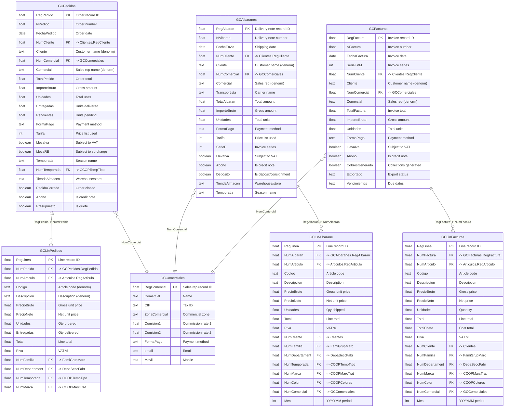
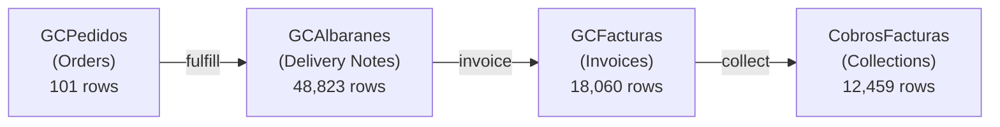

# Wholesale / Gestion Comercial Domain

> Wholesale orders, delivery notes, invoices, and sales representatives.

## Entity Relationship Diagram



## Wholesale Document Flow



## Table Descriptions

| Table | Rows | Columns | Description |
|-------|------|---------|-------------|
| **GCPedidos** | 101 | 124 | Wholesale purchase orders from B2B customers. Contains order totals, VAT breakdown, payment terms, season, and delivery dates. |
| **GCLinPedidos** | 2,645 | 240 | Order line items. One row per article per order with pricing, quantities ordered/delivered. |
| **GCAlbaranes** | 48,823 | 163 | Wholesale delivery notes (albaranes). Documents for goods shipped to wholesale customers with transport and fiscal data. |
| **GCLinAlbarane** | 1,013,799 | 139 | Delivery note line items. The largest wholesale table -- one row per article per shipment. |
| **GCFacturas** | 18,060 | 185 | Wholesale invoices with full fiscal data, payment terms, and collection status. |
| **GCLinFacturas** | 974,742 | 63 | Invoice line items with article, pricing, cost, and period data. |
| **GCComerciales** | 5 | 50 | Sales representatives/commercial agents. Commission structures and contact info. |

## Supporting Tables

| Table | Rows | Description |
|-------|------|-------------|
| GCContactos | 5 | Additional contacts for wholesale clients |
| GCTransporte | 9 | Transport/carrier definitions |
| GCGestionIncidencias | 37 | Incident management for wholesale |
| GCIncidencias | 5 | Incident type records |
| GCTiposIncidencias | 1 | Incident type definitions |
| DivisionPedido | 1,922 | Order split/allocation records |
| DivisionAlbaran | 2,511 | Delivery note split records |

## Empty / Unused Tables

| Table | Description |
|-------|-------------|
| GCPedidoTipo | Order type definitions |
| GCAsignaciones | Stock assignments to orders |
| GCCondicionesFactura | Special invoice conditions |
| GCSistemaComisiones | Commission system rules |
| GCZonasCom | Commercial zone definitions |

## Notes

- The wholesale flow follows a standard document chain: **Order -> Delivery Note -> Invoice -> Collection**.
- **GCLinAlbarane** (1M+ rows) is the primary source for wholesale sales analytics, carrying full product classification (family, department, season, brand, color) denormalized for reporting.
- **GCLinFacturas** closely mirrors GCLinAlbarane but at the invoice level. Both carry `Mes` (YYYYMM) for period filtering.
- All header tables (GCPedidos, GCAlbaranes, GCFacturas) link to `Clientes` via `NumCliente` and to `GCComerciales` via `NumComercial`.
- **GCLinPedidos** has 240 columns (the widest line table), likely due to size-level detail columns (quantities per size slot).

## ETL Sync Strategy

> Validated against production data 2026-03-30.

| Table | Rows | Delta field | Strategy |
|-------|------|-------------|---------|
| GCAlbaranes | 48,948 | `Modifica` (~19 modified/day, ~833/month) | UPSERT delta |
| GCLinAlbarane | 1,016,290 | **None** | Delete+reinsert via parent `Modifica` |
| GCFacturas | 18,060 | `Modifica` (all rows populated) | UPSERT delta |
| GCLinFacturas | 974,742 | **None** | Delete+reinsert via parent `Modifica` |
| GCPedidos | 101 | `Modifica` | Full refresh (trivially small) |
| GCLinPedidos | 2,645 | None | Full refresh (trivially small) |

**Lines delta pattern** (no modification timestamp on line tables):
```sql
-- Fetch lines for recently changed delivery notes
SELECT * FROM GCLinAlbarane
WHERE NAlbaran IN (SELECT NAlbaran FROM GCAlbaranes WHERE Modifica > :last_sync)
-- → DELETE + INSERT in PostgreSQL for those NAlbaran values
```

**FK corrections (important):**
- `GCLinAlbarane.NAlbaran` → `GCAlbaranes.NAlbaran` (not RegAlbaran — these are different fields)
- `GCLinFacturas.NumFactura` → `GCFacturas.NFactura` (note asymmetric naming)

See [etl-sync-strategy.md](../etl-sync-strategy.md) for the full sync plan.
